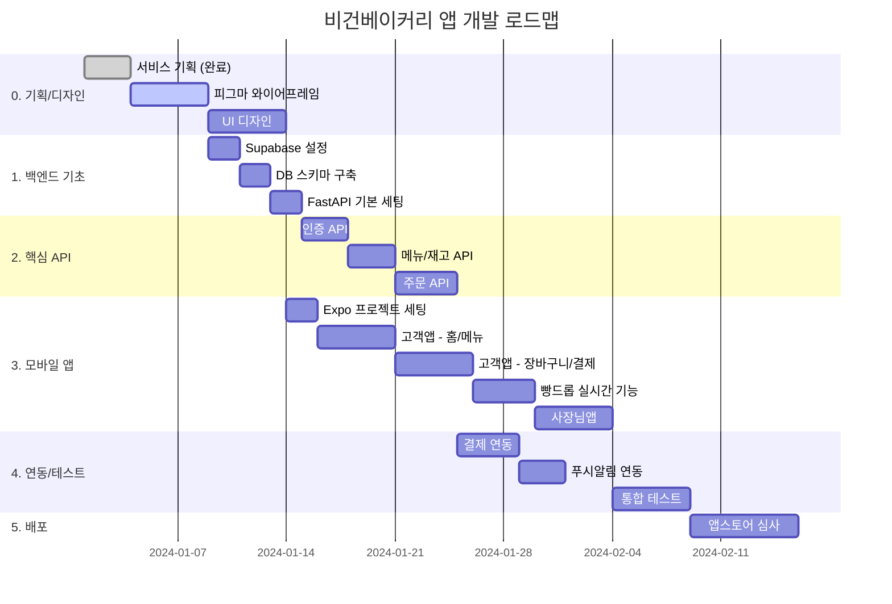
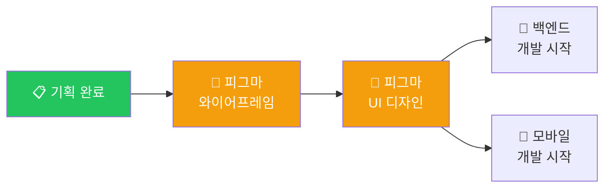

# 🗺️ 개발 로드맵

> 비건베이커리 앱 MVP 개발 로드맵
> **예상 기간**: 8-10주 (1인 개발 기준)

---

## 📅 전체 일정 개요



---

## 🎨 Phase 0: 기획 & 디자인 (1-2주)

### 디자인이 개발보다 먼저인 이유

> 디자인 없이 개발하면 **나중에 다시 만들어야** 합니다!
> 피그마로 화면을 먼저 그리면 개발할 때 **그대로 따라 만들면** 됩니다.

### 작업 순서



### 0-1. 와이어프레임 (3-5일)

| 작업 | 설명 | 산출물 |
|---|---|---|
| 고객앱 화면 설계 | 홈, 메뉴, 장바구니, MY | 피그마 와이어프레임 |
| 사장님앱 화면 설계 | 대시보드, 재고, 주문, 설정 | 피그마 와이어프레임 |
| 플로우 연결 | 화면 간 이동 흐름 | 피그마 프로토타입 |

### 0-2. UI 디자인 (5-7일)

| 작업 | 설명 | 산출물 |
|---|---|---|
| 디자인 시스템 | 컬러, 타이포, 컴포넌트 | 피그마 컴포넌트 |
| 고객앱 UI | 실제 색상/폰트 적용 | 피그마 디자인 |
| 사장님앱 UI | 실제 색상/폰트 적용 | 피그마 디자인 |
| 에셋 내보내기 | 아이콘, 이미지 추출 | PNG/SVG 파일 |

### 📁 디자인 파일 위치

```
bakery/
├── design/                     # 🎨 디자인 에셋
│   ├── assets/                 # 피그마에서 내보낸 에셋
│   │   ├── icons/             # 아이콘 (SVG)
│   │   ├── images/            # 이미지 (PNG, WebP)
│   │   └── splash/            # 스플래시 스크린
│   ├── fonts/                  # 커스텀 폰트 (있다면)
│   └── README.md              # 피그마 링크, 디자인 가이드
│
├── docs/
│   ├── flowchart_visual_guide.md  # 플로우차트 (피그마 참고용)
│   └── ...
```

### 피그마 파일 구조 추천

```
📂 비건베이커리 앱 (Figma 프로젝트)
├── 📄 Cover (표지)
├── 📄 Design System (컬러, 타이포, 컴포넌트)
├── 📄 Customer App - Wireframe (와이어프레임)
├── 📄 Customer App - UI (최종 디자인)
├── 📄 Admin App - Wireframe
├── 📄 Admin App - UI
└── 📄 Prototype (인터랙션 연결)
```

---

## 🐍 Phase 1: 백엔드 기초 (1주)

> 피그마 **와이어프레임 완료 후** 시작 (UI 디자인과 병렬 진행 가능)

### 1-1. Supabase 설정 (2일)

- [ ] Supabase 프로젝트 생성
- [ ] 환경 변수 설정 (.env)
- [ ] 카카오 소셜 로그인 설정

### 1-2. DB 스키마 구축 (2일)

- [ ] 테이블 생성 (users, products, inventory, orders 등)
- [ ] RLS (Row Level Security) 설정
- [ ] seed.sql로 테스트 데이터 추가

### 1-3. FastAPI 기본 세팅 (2일)

- [ ] 프로젝트 구조 생성
- [ ] Supabase 연동 설정
- [ ] 기본 라우터 구조 잡기

**산출물**: 로컬에서 FastAPI 서버 실행, Supabase DB 연결 확인

---

## 🔌 Phase 2: 핵심 API 개발 (2주)

### 2-1. 인증 API (3일)

```python
# 예시 엔드포인트
POST /auth/kakao       # 카카오 로그인
POST /auth/refresh     # 토큰 갱신
GET  /auth/me          # 현재 사용자 정보
```

### 2-2. 메뉴/재고 API (3일)

```python
GET  /products              # 메뉴 목록
GET  /products/{id}         # 메뉴 상세
GET  /inventory             # 재고 현황 (실시간은 Supabase 직접)
PATCH /inventory/{id}       # 재고 수정 (사장님)
```

### 2-3. 주문 API (4일)

```python
POST /orders               # 주문 생성
GET  /orders               # 주문 목록
GET  /orders/{id}          # 주문 상세
PATCH /orders/{id}/status  # 주문 상태 변경 (사장님)
```

**산출물**: Swagger 문서 (/docs), 모든 API 테스트 통과

---

## 📱 Phase 3: 모바일 앱 개발 (3-4주)

> 피그마 **UI 디자인 완료 후** 본격 시작

### 3-1. 프로젝트 세팅 (2일)

- [ ] Expo 프로젝트 생성
- [ ] 네비게이션 구조 설정
- [ ] Supabase 클라이언트 설정
- [ ] 디자인 에셋 연동

### 3-2. 고객앱 - 기본 화면 (5일)

| 화면 | 주요 기능 |
|---|---|
| 홈 | 빵드롭 카운트다운, 추천 메뉴 |
| 메뉴 | 카테고리 탭, 상품 리스트 |
| 상세 | 상품 정보, 수량 선택, 담기, **❤️ 찜하기** |
| MY | 주문 내역, **찜 목록**, 알림 설정 |

### 3-3. 고객앱 - 주문/결제 (5일)

| 화면 | 주요 기능 |
|---|---|
| 장바구니 | 상품 목록, 픽업시간 선택 |
| 결제 | PortOne 연동, 카카오/네이버페이 |
| 완료 | 주문번호, QR 픽업권 |

### 3-4. 빵드롭 실시간 기능 (4일)

- [ ] Supabase Realtime 구독 설정
- [ ] 재고 실시간 UI 업데이트
- [ ] 품절 상태 처리
- [ ] 푸시 알림 연동

### 3-5. 사장님앱 (5일)

| 화면 | 주요 기능 |
|---|---|
| 대시보드 | 오늘 현황, 출고 알림 발송 |
| 재고 관리 | 수량 조정 (+/-) |
| 주문 관리 | 주문 확인/준비중/완료 |
| 설정 | 알림, 메뉴 관리 |

**산출물**: 고객앱/사장님앱 시뮬레이터 실행, 백엔드 연동 완료

---

## 🔗 Phase 4: 연동 & 테스트 (1-2주)

### 4-1. 결제 연동 (4일)

- [ ] PortOne 설정
- [ ] 카카오페이 테스트
- [ ] 네이버페이 테스트
- [ ] 결제 완료 → 주문 확정 플로우

### 4-2. 푸시알림 연동 (2일)

- [ ] Firebase FCM 설정
- [ ] 푸시 토큰 저장
- [ ] **찜한 빵 출고 알림** (개인화)
- [ ] 주문 상태 알림 테스트

### 4-3. 통합 테스트 (5일)

- [ ] 전체 주문 플로우 테스트
- [ ] 실시간 재고 동기화 테스트
- [ ] 버그 수정
- [ ] 성능 최적화

**산출물**: 실제 결제 테스트 완료, 푸시 알림 동작 확인

---

## 🚀 Phase 5: 배포 (1-2주)

### 5-1. 백엔드 배포 (2일)

- [ ] FastAPI → Vercel/Railway 배포
- [ ] 환경 변수 설정
- [ ] 도메인 연결

### 5-2. 앱 빌드 (2일)

- [ ] 고객앱 빌드 (iOS/Android)
- [ ] 사장님앱 빌드 (iOS/Android)
- [ ] 앱 아이콘, 스플래시 적용

### 5-3. 앱스토어 심사 (5-7일)

- [ ] Apple App Store 심사 제출
- [ ] Google Play Store 심사 제출
- [ ] 리젝 시 수정 대응

**산출물**: 앱스토어 출시 완료! 🎉

---

## ✅ 체크리스트 요약

### 🎨 디자인 (Phase 0)

- [ ] 피그마 와이어프레임 완료
- [ ] 피그마 UI 디자인 완료
- [ ] 디자인 에셋 내보내기

### 🐍 백엔드 (Phase 1-2)

- [ ] Supabase 설정
- [ ] DB 스키마 생성
- [ ] FastAPI 기본 세팅
- [ ] 인증 API
- [ ] 메뉴/재고 API
- [ ] 주문 API

### 📱 모바일 (Phase 3)

- [ ] 고객앱 기본 화면
- [ ] 고객앱 주문/결제
- [ ] 빵드롭 실시간 기능
- [ ] 사장님앱

### 🔗 연동 (Phase 4)

- [ ] 결제 연동
- [ ] 푸시알림 연동
- [ ] 통합 테스트

### 🚀 배포 (Phase 5)

- [ ] 백엔드 배포
- [ ] 앱 빌드
- [ ] 앱스토어 심사

---

## 📊 예상 일정 (1인 개발 기준)

| Phase | 작업 | 기간 | 누적 |
|:---:|---|---|---|
| 0 | 피그마 디자인 | 1-2주 | 1-2주 |
| 1 | 백엔드 기초 | 1주 | 2-3주 |
| 2 | 핵심 API | 2주 | 4-5주 |
| 3 | 모바일 앱 | 3-4주 | 7-9주 |
| 4 | 연동/테스트 | 1-2주 | 8-10주 |
| 5 | 배포 | 1-2주 | **9-12주** |

> 💡 **병렬 진행 가능**: Phase 1(백엔드)와 Phase 0-2(UI디자인)는 동시 진행 가능

---

## 🎯 다음 단계

**지금 해야 할 일:**

1. ✅ 서비스 기획 (완료)
2. ✅ 기술스택 확정 (완료)
3. **🎨 피그마 와이어프레임 시작** ← 현재 단계!

피그마 작업을 시작하시겠어요? 아니면 다른 부분에 대해 더 논의할까요? 🍞
