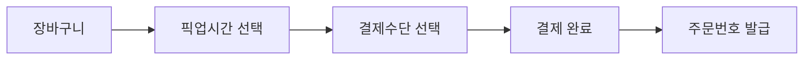
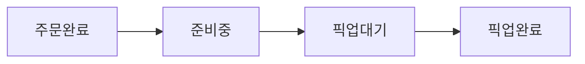
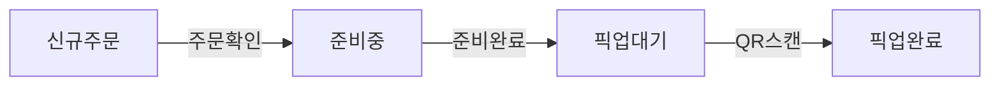
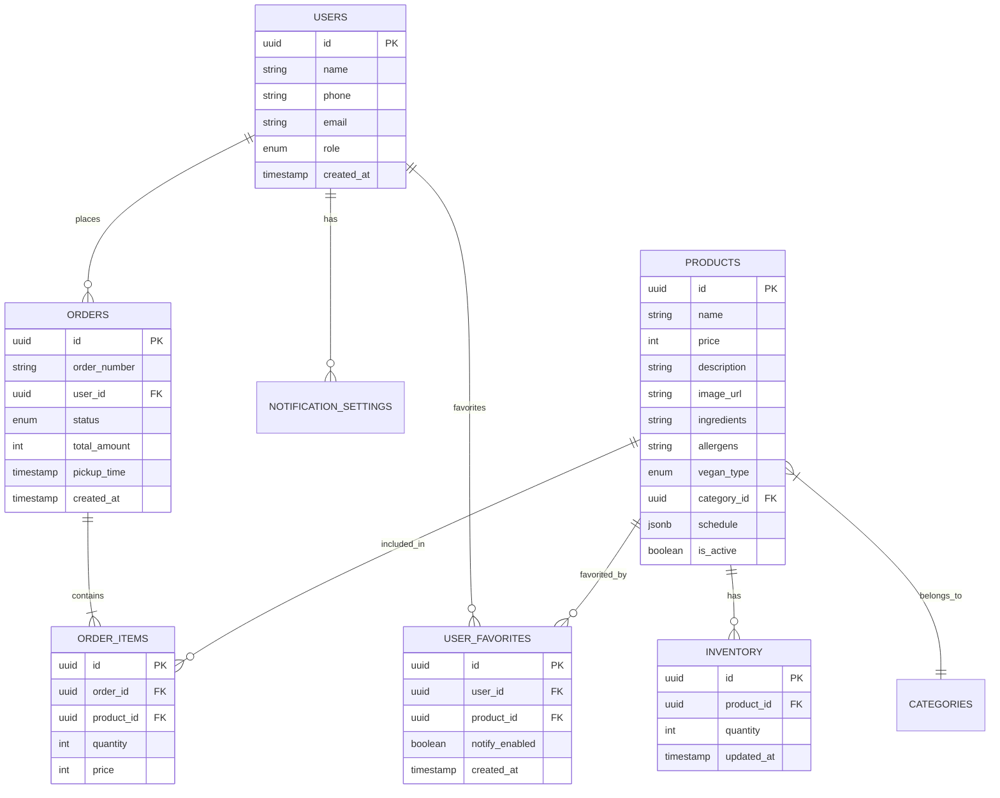

# 상세 기능 명세서

> 비건 베이커리 앱 - 기능별 상세 스펙

---

## 📱 앱 구성

| **앱** | **대상** | **주요 기능** |
| --- | --- | --- |
| **고객용 앱** | 손님 | 메뉴 확인, 주문, 픽업, 알림 수신 |
| **사장님용 앱** | 관리자 | 재고 관리, 주문 처리, 알림 발송 |

---

## 🛒 고객용 앱 기능

### 1. 홈 / 오늘의 빵 (MVP)

### 화면 구성

```
┌─────────────────────────────────┐
│ 🥐 비건베이커리          [알림] │
├─────────────────────────────────┤
│ 📍 오늘의 영업시간: ~19:00      │
├─────────────────────────────────┤
│ ⏰ 다음 출고: 11:30 (30분 후)   │
│ [기본소금빵] [으깬감자치즈] ... │
├─────────────────────────────────┤
│ 🍞 지금 판매중                  │
│ ┌─────┐ ┌─────┐ ┌─────┐       │
│ │ 소금 │ │베이글│ │ 스콘 │       │
│ │ 빵  │ │     │ │     │       │
│ │ 12개│ │ 5개 │ │ 품절│       │
│ └─────┘ └─────┘ └─────┘       │
├─────────────────────────────────┤
│ 🔥 오늘 인기 빵 TOP 3           │
│ ┌─────┐ ┌─────┐ ┌─────┐       │
│ │ 🥇  │ │ 🥈  │ │ 🥉  │       │
│ │소금빵│ │베이글│ │시나몬│       │
│ │ 32개│ │ 18개│ │ 12개│  판매량│
│ │ 8개↓│ │ 5개↓│ │ 3개↓│  재  고│
│ └─────┘ └─────┘ └─────┘       │
├─────────────────────────────────┤
│ [홈] [메뉴] [주문내역] [마이]   │
└─────────────────────────────────┘
```

### 기능 상세

| **요소** | **설명** | **데이터** |
| --- | --- | --- |
| 다음 출고 시간 | 가장 가까운 출고 타이밍 표시 | menu_schedule |
| 실시간 재고 | 현재 남은 수량 표시 | inventory (realtime) |
| 재고 상태 | 판매중/소진임박(3개이하)/품절 | 계산값 |
| **🔥 인기 랭킹** | **오늘 판매량 기준 TOP 3 빵 표시** | **daily_sales (계산)** |

---

### 2. 메뉴 상세 (MVP)

### 화면 구성

```
┌─────────────────────────────────┐
│ ← 기본소금빵                    │
├─────────────────────────────────┤
│ ┌─────────────────────────────┐ │
│ │      [빵 이미지]            │ │
│ └─────────────────────────────┘ │
│                                 │
│ 기본소금빵              ₩3,000  │
│ ⭐ 인기메뉴                     │
│                                 │
│ 🌱 100% 비건                    │
│ 바삭한 겉과 부드러운 속이       │
│ 특징인 시그니처 소금빵          │
│                                 │
│ ──────────────────────────────  │
│ 👥 이런 분들이 좋아해요         │
│ "출근 전 간편한 아침으로 딱!"   │
│ "수업 사이에 먹기 좋아요 🎒"    │
│ 직장인·대학생에게 인기          │
│                                 │
│ ──────────────────────────────  │
│ ⭐ 베스트 리뷰                  │
│ ┌───────────────────────────┐   │
│ │ ⭐⭐⭐⭐⭐ 김*영            │   │
│ │ "진짜 맛있어요! 비건인데   │   │
│ │  일반 빵이랑 차이 모름"    │   │
│ │ 👍 23명이 도움됐어요       │   │
│ └───────────────────────────┘   │
│        [리뷰 전체보기 →]        │
│                                 │
│ ──────────────────────────────  │
│ 📋 영양정보                     │
│ • 원재료: 밀가루, 비건버터...   │
│ • 알레르기: 밀                  │
│ • 칼로리: 280kcal               │
│                                 │
│ ⏰ 출고시간: 08:00, 11:30       │
│ 📦 현재 재고: 12개              │
├─────────────────────────────────┤
│   [❤️ 찜하기]  [장바구니 담기]   │
└─────────────────────────────────┘
```

### 필수 정보

| **항목** | **필수** | **MVP** | **설명** |
| --- | --- | --- | --- |
| 제품명 | ✅ | ✅ | - |
| 가격 | ✅ | ✅ | - |
| 이미지 | ✅ | ✅ | 1장 이상 |
| 비건 등급 | ✅ | ✅ | 100% 비건 / 락토 등 |
| 설명 | ✅ | ✅ | 맛, 특징 |
| **👥 고객 선호** | **✅** | **✅** | **어떤 분들이 좋아하는지 (사장님 작성)** |
| 원재료 | ✅ | ✅ | 상세 리스트 |
| 알레르기 | ✅ | ✅ | 밀, 견과류 등 |
| 출고 시간 | ✅ | ✅ | 언제 나오는지 |
| 현재 재고 | ✅ | ✅ | 실시간 |
| 칼로리 | ❌ | ❌ | 확장 기능 |
| 스토리 | ❌ | ❌ | 재료 스토리텔링 |

---

### 3. 주문 / 결제 (MVP)

### 주문 플로우



### 장바구니

| **기능** | **설명** |
| --- | --- |
| 상품 추가/삭제 | 수량 조절 |
| 재고 확인 | 주문 시점 재고 검증 |
| 합계 표시 | 실시간 계산 |

### 픽업 시간 선택

```
┌─────────────────────────────────┐
│ 픽업 시간을 선택하세요          │
├─────────────────────────────────┤
│ 오늘                            │
│ ○ 11:30 이후 (30분 후)         │
│ ○ 12:00 이후                   │
│ ○ 13:00 이후                   │
│ ● 14:00 이후 ✓                 │
├─────────────────────────────────┤
│ ⚠️ 당일 19:00까지 픽업 필수     │
└─────────────────────────────────┘
```

### 결제

| **수단** | **MVP** | **설명** |
| --- | --- | --- |
| 카카오페이 | ✅ | PortOne 연동 |
| 네이버페이 | ✅ | PortOne 연동 |
| 신용카드 | ❌ | 확장 |
| 현장결제 | ❌ | 확장 (옵션) |

---

### 4. 주문 내역 / 픽업 (MVP)

### 주문 상태



### 픽업 화면

```
┌─────────────────────────────────┐
│ 주문번호: #2024121500042        │
├─────────────────────────────────┤
│ ┌─────────────────────────────┐ │
│ │      [QR 코드]              │ │
│ │                             │ │
│ │   매장에서 보여주세요       │ │
│ └─────────────────────────────┘ │
│                                 │
│ 상태: 🟢 픽업 가능              │
│ 픽업시간: 14:00 이후            │
│                                 │
│ ──────────────────────────────  │
│ 기본소금빵 x2         ₩6,000    │
│ 으깬감자치즈 x1       ₩3,900    │
│ ──────────────────────────────  │
│ 합계                  ₩9,900    │
└─────────────────────────────────┘
```

---

### 5. 찜하기 & 개인화 알림 (MVP)

> **핵심 컨셉**: 사용자가 좋아하는 빵만 찜하고, 그 빵이 출고될 때만 알림을 받습니다.
> 스팸 알림 피로감 없이 원하는 정보만 받을 수 있습니다.

### 찜하기 기능

| **기능** | **설명** |
| --- | --- |
| 찜 추가 | 메뉴 상세에서 ❤️ 버튼 탭 |
| 찜 해제 | 다시 탭하면 해제 |
| 알림 연동 | 찜 시 "이 빵 나오면 알림 받을까요?" 선택 |
| 찜 목록 | MY 페이지에서 찜한 빵 모아보기 |

### 찜하기 플로우

```
┌─────────────────────────────────┐
│ 기본소금빵을 찜했어요! ❤️        │
├─────────────────────────────────┤
│                                 │
│  이 빵이 출고되면 알림을         │
│  받으시겠어요?                  │
│                                 │
│  ┌───────────┐  ┌───────────┐  │
│  │  아니요   │  │ 🔔 알림받기│  │
│  └───────────┘  └───────────┘  │
│                                 │
└─────────────────────────────────┘
```

### 알림 종류

| **알림** | **트리거** | **내용 예시** |
| --- | --- | --- |
| 🍞 찜한 빵 출고 | 찜+알림ON 빵 출고 시 | "❤️ 찜한 기본소금빵이 방금 나왔어요!" |
| ✅ 주문 상태 | 상태 변경 시 | "주문이 준비되었어요" |
| 🏷️ 마감 할인 | 수동 발송 | "소금빵 30% 할인! 3개 남음" |

### 알림 설정 화면

```
┌─────────────────────────────────┐
│ 🔔 알림 설정                    │
├─────────────────────────────────┤
│                                 │
│ 📌 찜한 빵 알림                  │
│ ┌─────────────────────────────┐ │
│ │ 🥐 기본소금빵        [ON]   │ │
│ │ 🍞 시나몬롤          [ON]   │ │
│ │ 🥖 통밀바게트        [OFF]  │ │
│ └─────────────────────────────┘ │
│                                 │
│ 🛒 주문 관련 알림               │
│ ┌─────────────────────────────┐ │
│ │ 주문 상태 알림       [ON]   │ │
│ └─────────────────────────────┘ │
│                                 │
│ 🏷️ 마감 할인 알림      [OFF]    │
│                                 │
└─────────────────────────────────┘
```

---

## 🏪 사장님용 앱 기능

### 1. 대시보드 (MVP)

```
┌─────────────────────────────────┐
│ 📊 오늘의 현황    12/15 (일)    │
├─────────────────────────────────┤
│ 💰 오늘 매출                    │
│    ₩847,000                     │
│                                 │
│ 📦 주문        🕐 대기          │
│    42건           3건           │
├─────────────────────────────────┤
│ ⏰ 다음 출고: 11:30             │
│ [출고 알림 보내기]              │
├─────────────────────────────────┤
│ 🔔 최근 주문                    │
│ • #042 기본소금빵 x2 (방금)     │
│ • #041 베이글 x1 (3분전)        │
└─────────────────────────────────┘
```

---

### 2. 재고 관리 (MVP - 핵심)

```
┌─────────────────────────────────┐
│ 📦 재고 관리                    │
├─────────────────────────────────┤
│ 🔍 [검색...]        [카테고리▼] │
├─────────────────────────────────┤
│ 기본소금빵                      │
│ [－]  12개  [＋]    [품절처리]  │
│─────────────────────────────────│
│ 으깬감자 소금빵                 │
│ [－]   5개  [＋]    [품절처리]  │
│─────────────────────────────────│
│ 시나몬롤                        │
│ [－]   0개  [＋]    [품절 🔴]   │
├─────────────────────────────────┤
│ [일괄 출고 등록]                │
└─────────────────────────────────┘
```

### 재고 업데이트 방식

| **방법** | **설명** |
| --- | --- |
| 수동 조절 | +/- 버튼으로 개별 조절 |
| 일괄 등록 | 출고 시 여러 메뉴 한번에 |
| 품절 처리 | 원클릭 품절 |
| 판매 차감 | 주문 시 자동 감소 |

---

### 3. 주문 관리 (MVP)

```
┌─────────────────────────────────┐
│ 📋 주문 목록       [대기중 3]   │
├─────────────────────────────────┤
│ 🟡 #042 | 14:00 픽업            │
│    기본소금빵 x2, 베이글 x1     │
│    [준비완료]                   │
│─────────────────────────────────│
│ 🟢 #041 | 13:30 픽업 ✓준비완료  │
│    치아바타 x1                  │
│    [픽업확인]                   │
│─────────────────────────────────│
│ ⚪ #040 | 13:00 픽업 ✓완료      │
└─────────────────────────────────┘
```

### 주문 처리 플로우



---

### 4. 알림 발송 (P1)

```
┌─────────────────────────────────┐
│ 🔔 알림 발송                    │
├─────────────────────────────────┤
│ 빠른 발송                       │
│ [🍞 출고알림] [🏷️ 마감할인]    │
│ [📢 공지사항] [🚫 휴무안내]    │
├─────────────────────────────────┤
│ 마감 할인 설정                  │
│ 대상: ☑️ 소금빵 ☑️ 베이글      │
│ 할인율: [30%  ▼]               │
│ 메시지: [마감임박! 30% 할인..] │
│                                 │
│ [알림 발송하기]                 │
└─────────────────────────────────┘
```

---

## 🗄️ 데이터 모델

### 핵심 테이블



---

## 🔌 API 엔드포인트 (주요)

### 고객용

| **Method** | **Endpoint** | **설명** |
| --- | --- | --- |
| GET | /products | 메뉴 목록 |
| GET | /products/:id | 메뉴 상세 |
| GET | /inventory | 실시간 재고 |
| **GET** | **/products/popular** | **🔥 오늘 인기 빵 TOP N** |
| POST | /orders | 주문 생성 |
| GET | /orders/:id | 주문 상세 |
| GET | /orders/my | 내 주문 목록 |
| **GET** | **/products/:id/reviews** | **⭐ 상품 리뷰 목록** |
| **GET** | **/products/:id/reviews/best** | **⭐ 베스트 리뷰** |
| **POST** | **/reviews** | **⭐ 리뷰 작성** |
| **POST** | **/reviews/:id/helpful** | **👍 도움됐어요** |
| **POST** | **/favorites** | **찜 추가** |
| **DELETE** | **/favorites/:id** | **찜 삭제** |
| **GET** | **/favorites** | **내 찜 목록** |
| **PATCH** | **/favorites/:id** | **알림 ON/OFF** |
| **POST** | **/events** | **사용자 행동 로깅** |

### 사장님용

| **Method** | **Endpoint** | **설명** |
| --- | --- | --- |
| PATCH | /inventory/:id | 재고 수정 |
| GET | /admin/orders | 전체 주문 |
| PATCH | /admin/orders/:id | 주문상태 변경 |
| POST | /admin/notifications | 알림 발송 |
| **POST** | **/admin/production** | **출고/생산 등록** |
| **GET** | **/admin/analytics** | **판매 분석 데이터** |
| **GET** | **/admin/forecast** | **AI 예측 결과 (Phase 3)** |

---

## 📅 MVP 범위 정리

### MVP (8주)

- [ ] 메뉴 목록 및 상세 정보
- [ ] 실시간 재고 표시
- [ ] **🔥 오늘 인기 빵 랭킹 (홈 화면)**
- [ ] 빵드롭 카운트다운 + 미리담기
- [ ] 사전 주문 및 결제 (카카오페이/네이버페이)
- [ ] 픽업 관리 (QR코드)
- [ ] 사장님 재고 관리
- [ ] 사장님 주문 확인
- [ ] 푸시 알림 (출고/주문)
- [ ] **사용자 행동 로깅 (user_events 수집)**
- [ ] **생산 등록 (production_logs 수집)**

### Phase 2: 확장 (+1개월)

- [ ] 마감 할인 기능
- [ ] 멤버십/포인트
- [ ] 인스타그램 연동
- [ ] **일별 스냅샷 자동 저장**
- [ ] **기본 판매 분석 대시보드**

### Phase 3: AI 고도화 (+3개월)

- [ ] **외부 데이터 수집 (날씨, 학사일정)**
- [ ] **AI 수요 예측**
- [ ] **발주 추천 시스템**
- [ ] **레시피/원재료 관리**

---

## 🤖 AI 데이터 수집 기능 (상세)

### 1. 사용자 행동 로깅 (MVP)

> 앱 사용 패턴을 자동 수집하여 AI 학습 데이터 확보

### 수집 이벤트

| **이벤트** | **트리거** | **메타데이터** |
| --- | --- | --- |
| `app_open` | 앱 실행 | 시간대 |
| `view_product` | 메뉴 상세 진입 | product_id |
| `add_cart` | 장바구니 담기 | product_id, quantity |
| `drop_waiting` | 빵드롭 대기 화면 진입 | drop_time, duration |
| `pre_order` | 미리담기 완료 | product_ids |
| `push_click` | 푸시 알림 클릭 | notification_type |
| `search` | 검색 | keyword |

### 구현 방식

```typescript
// 앱 내 이벤트 추적 훅
const useEventTracking = () => {
  const trackEvent = async (eventType: string, metadata?: object) => {
    await supabase.from('user_events').insert({
      user_id: currentUser?.id,
      event_type: eventType,
      metadata,
    });
  };
  return { trackEvent };
};
```

---

### 2. 생산 등록 (MVP - 사장님 앱)

> 출고 시 생산량을 기록하여 공급 데이터 확보

### 화면 (재고 관리에 추가)

```
┌─────────────────────────────────┐
│ 📦 출고 등록                    │
├─────────────────────────────────┤
│ ⏰ 11:30 출고                   │
│                                 │
│ 기본소금빵        [  30  ]개    │
│ 으깬감자치즈      [  20  ]개    │
│ 할라피뇨감자치즈  [  15  ]개    │
│ 시나몬롤          [   0  ]개    │
│                                 │
│ ┌─────────────────────────────┐ │
│ │     출고 등록 + 알림 발송    │ │  ← 한 번에 처리
│ └─────────────────────────────┘ │
└─────────────────────────────────┘
```

### 기능

| **항목** | **설명** |
| --- | --- |
| 일괄 수량 입력 | 해당 출고 시간대 빵 수량 입력 |
| 재고 자동 반영 | inventory 테이블에 추가 |
| 생산 로그 저장 | production_logs에 기록 |
| 알림 동시 발송 | 출고 알림 트리거 |

---

### 3. 일별 스냅샷 (Phase 2)

> 마감 시 하루 판매 데이터를 자동 저장

### 트리거

- **시간**: 매일 19:00 (영업 종료 시)
- **방식**: Supabase Edge Function (cron)

### 저장 데이터

```
daily_inventory_snapshot:
- 메뉴별 생산량 (produced_qty)
- 메뉴별 판매량 (sold_qty)
- 메뉴별 잔여량 (remaining_qty)
- 품절 시각 (soldout_at)
```

---

### 4. 판매 분석 대시보드 (Phase 2 - 사장님 앱)

```
┌─────────────────────────────────┐
│ 📊 판매 분석                    │
├─────────────────────────────────┤
│ 📅 기간: [이번 주 ▼]            │
│                                 │
│ 💰 총 매출: ₩8,470,000          │
│ 📦 총 판매: 342개               │
│ 🗑️ 폐기량: 23개 (6.7%)         │
│                                 │
│ ─────────────────────────────── │
│                                 │
│ 🏆 인기 메뉴 TOP 5              │
│ 1. 기본소금빵 (89개)           │
│ 2. 시나몬롤 (56개)             │
│ 3. 베이글 (48개)               │
│                                 │
│ ─────────────────────────────── │
│                                 │
│ ⏰ 시간대별 판매량              │
│ [막대 차트: 08~19시]           │
│                                 │
│ 📅 요일별 패턴                  │
│ [라인 차트: 월~일]             │
│                                 │
└─────────────────────────────────┘
```

---

### 5. AI 발주 추천 (Phase 3 - 사장님 앱)

```
┌─────────────────────────────────┐
│ 🤖 AI 발주 추천                 │
├─────────────────────────────────┤
│ 📅 내일 12/16 (월) 예측        │
│ 상황: 학기중, 맑음             │
│                                 │
│ ─────────────────────────────── │
│                                 │
│ 기본소금빵                      │
│ 예상 판매: 45~52개             │
│ 권장 생산: [50]개   [채택]     │
│ 신뢰도: ████████░░ 87%         │
│                                 │
│ 시나몬롤                        │
│ 예상 판매: 18~24개             │
│ 권장 생산: [22]개   [수정]     │
│ 신뢰도: ███████░░░ 79%         │
│                                 │
│ ─────────────────────────────── │
│                                 │
│ 📦 원재료 발주 추천             │
│ 비건버터: +3kg 필요            │
│ 밀가루: 충분                   │
│                                 │
│ [발주서 생성]                   │
└─────────────────────────────────┘
```
