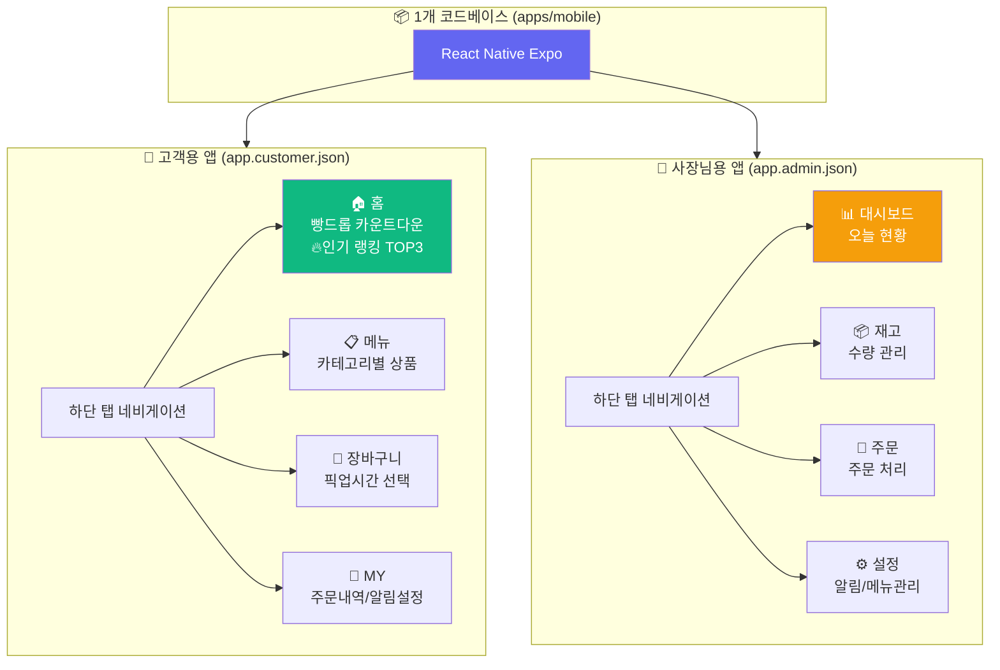
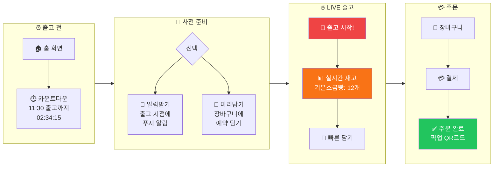
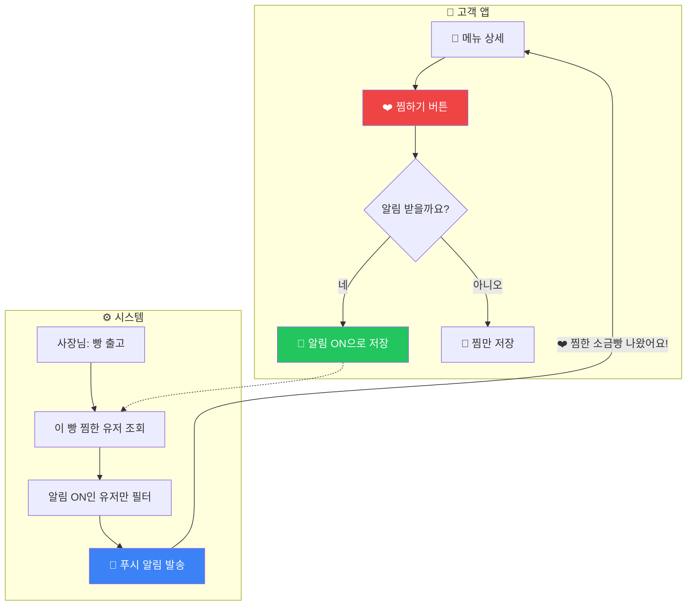
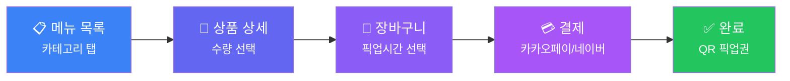
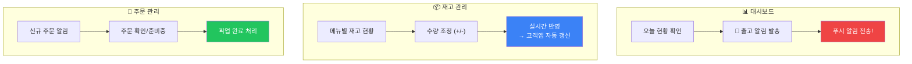
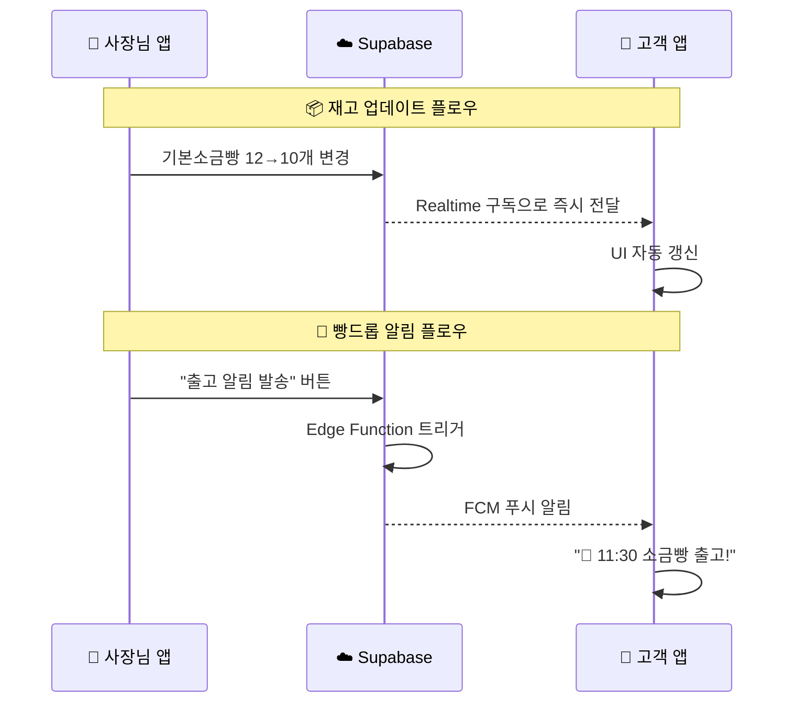
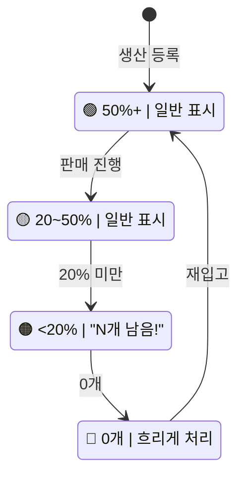
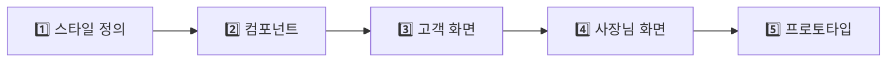

# 🎨 비건베이커리 앱 플로우차트 (피그마 참고용)

> 피그마에서 와이어프레임 작업 시 참고할 시각적 플로우차트
> **빌드 전략**: 1개 코드베이스에서 고객용/사장님용 2개 앱을 빌드

---

## 1. 📱 전체 앱 구조

**고객용 앱**과 **사장님용 앱**의 전체 네비게이션 구조입니다.



### 핵심 포인트

| 앱 | 탭 구성 | 주요 기능 |
|---|---|---|
| 고객용 | 홈 / 메뉴 / 장바구니 / MY (4탭) | 빵드롭, 🔥인기 랭킹, 주문, 알림설정 |
| 사장님용 | 대시보드 / 재고 / 주문 / 설정 (4탭) | 출고알림, 재고관리, 주문처리 |

---

## 2. 🔥 빵드롭 (Bread Drop) 플로우

이 앱의 **킬러 기능**! 갓 구운 빵을 잡기 위한 고객 여정입니다.



### 빵드롭 단계별 정리

| 단계 | 화면 | 핵심 UI 요소 |
|:---:|---|---|
| 0️⃣ | 홈 | 🔥 인기 랭킹 TOP 3 (판매량, 남은 재고) |
| 1️⃣ | 홈 | 카운트다운 타이머 (HH:MM:SS) |
| 2️⃣ | 사전 준비 | "알림받기" / "미리담기" 버튼 |
| 3️⃣ | LIVE | 실시간 재고 수량, 빠른 담기 버튼 |
| 4️⃣ | 주문 | 결제 → QR코드 픽업권 발급 |

---

## 2.5. ❤️ 찜하기 & 개인화 알림 플로우

사용자가 **좋아하는 빵만 찜하고**, 그 빵이 출고될 때만 알림을 받는 플로우입니다.



### 핵심 포인트

| 단계 | 설명 | UI 요소 |
|:---:|---|---|
| 1️⃣ | 메뉴 상세에서 찜 | ❤️ 버튼 |
| 2️⃣ | 알림 수신 여부 선택 | 모달 팝업 |
| 3️⃣ | 출고 시 자동 알림 | 푸시 알림 |
| 4️⃣ | MY페이지에서 찜 목록 확인 | 찜 목록 화면 |

---

## 3. 🛒 일반 주문 프로세스

메뉴 탐색부터 결제 완료까지의 전체 흐름입니다.



### 화면별 핵심 요소

```
메뉴 탐색 → 상품 상세 → 장바구니 → 결제 → 완료
    │           │           │         │       │
카테고리탭   수량선택    픽업시간    결제수단   QR코드
  검색바    담기버튼    금액요약    주문정보   주문번호
```

---

## 4. 🏪 사장님용 앱 플로우

대시보드, 재고관리, 주문관리의 **3가지 핵심 플로우**입니다.



### 3가지 핵심 플로우

| 플로우 | 시작 | 종료 | 연동 |
|---|---|---|---|
| 🔔 알림 발송 | 대시보드 | 푸시 알림 전송 | Firebase FCM |
| 📦 재고 관리 | 재고 화면 | 고객앱 실시간 반영 | Supabase Realtime |
| 📝 주문 관리 | 주문 화면 | 픽업 완료 처리 | 주문 상태 업데이트 |

---

## 5. 🔄 사장님 ↔ 고객 실시간 연동

**1개 코드베이스에서 빌드된 2개 앱**이 백엔드를 통해 실시간으로 연동됩니다.



---

## 6. 📦 재고 상태 플로우

재고 수량에 따른 **상태 변화와 UI 표현**입니다.



### 상태별 UI 가이드

| 상태 | 조건 | 색상 코드 | UI 표현 |
|:---:|---|---|---|
| 🟢 충분 | 50%+ | `#43A047` | 일반 표시 |
| 🟡 보통 | 20~50% | `#FFA726` | 일반 표시 |
| � 소진임박 | <20% | `#FF7043` | 테두리 강조 + **"N개 남음!"** 뱃지 |
| 🔴 품절 | 0개 | `#E53935` | 흐리게 + ~~가격 취소선~~ |

---

## 🎯 피그마 작업 순서 (권장)



### 단계별 작업 내용

| 단계 | 작업 | 세부 내용 |
|:---:|---|---|
| 1️⃣ | 스타일 정의 | Color Styles, Text Styles 등록 |
| 2️⃣ | 컴포넌트 | 버튼, 카드, 인풋, 탭바, 모달 |
| 3️⃣ | 고객 화면 | 홈(빵드롭), 메뉴, 장바구니, MY |
| 4️⃣ | 사장님 화면 | 대시보드, 재고, 주문, 설정 |
| 5️⃣ | 프로토타입 | 화면 간 연결, 인터랙션 |

---

## 📐 프레임 설정 참고

| 설정 | 값 | 비고 |
|---|---|---|
| 프레임 크기 | **390 x 844** | iPhone 14 기준 |
| 상단바 높이 | 56px | 앱 헤더 |
| 하단탭 높이 | 83px | Safe Area 포함 |
| 화면 좌우 마진 | 20px | 콘텐츠 패딩 |
| 카드 border-radius | 16px | 둥근 모서리 |
| 버튼 border-radius | 12px | 둥근 모서리 |

---

## 🎨 컬러 팔레트 참고

| 용도 | 색상 | 코드 |
|---|---|---|
| Primary (메인 그린) | 🟢 | `#43A047` |
| Secondary (액센트) | 🟤 | `#8D6E63` |
| Warning (소진임박) | 🟠 | `#FF7043` |
| Error (품절/에러) | 🔴 | `#E53935` |
| Background | ⬜ | `#FAFAFA` |
| Card Background | ⬜ | `#FFFFFF` |
| Text Primary | ⬛ | `#212121` |
| Text Secondary | ⚫ | `#757575` |
