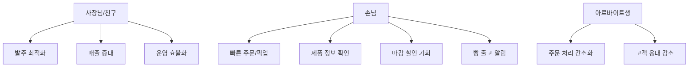

# 비건 베이커리 현황 분석

## 📍 비즈니스 개요

| **항목** | **내용** |
| --- | --- |
| **업종** | 비건 베이커리 |
| **위치** | 대학가 상권 (한국외대, 경희대, 한예종 인접) |
| **특징** | 당일 판매 원칙, 하루 2회 빵 출고 |
| **현재 예약 시스템** | 네이버 예약 |
| **SNS 운영** | 인스타그램 (공지사항, 메뉴 정보, 실시간 재고 릴스) |

---

## 🔍 현재 상황 및 Pain Points

### 1. 수요 예측의 어려움

- **문제**: 성수기(학기 중) / 비수기(방학) 패턴이 뚜렷하나 매출이 들쭉날쭉
- **영향**: 발주량 결정이 어려움 → 재고 과다 or 품절 발생
- **데이터 필요**: 요일별, 시간대별, 계절별 판매 패턴

### 2. 빵 정보 전달 부족

- **문제**: 손님들이 "비건빵이냐"고 자주 질문
- **원인**: 제품 정보(원재료, 비건 인증, 알레르기 정보)가 충분히 노출되지 않음
- **추가 정보**: 콩으로 만든 햄 등 특별한 재료 사용 → 스토리텔링 필요

### 3. 피크타임 혼잡

- **문제**: 빵 출고 시간(하루 2회)에 손님 집중
- **영향**: 대기시간 증가, 고객 경험 저하
- **니즈**: 매장에서 손님을 빠르게 응대하고 빼기

### 4. 마감 재고 처리

- **현재 방식**: 남은 빵을 포장해서 주변에 나눠줌
- **개선 기회**: 할인 판매, 미리 알림 등으로 판매 전환 가능

### 5. 예약 시스템 한계

- **현재**: 네이버 예약 사용
- **한계점 (추정)**:
    - 수수료 발생
    - 자체 고객 데이터 확보 어려움
    - 커스터마이징 제한
    - 푸시 알림 기능 제한

---

## 💡 기회 요인

| **기회** | **설명** |
| --- | --- |
| **대학가 상권** | 2030 타겟, 앱 사용에 익숙한 고객층 |
| **비건 트렌드** | MZ세대 중심 비건/친환경 소비 증가 |
| **반복 고객** | 대학생 특성상 정기적인 방문 패턴 |
| **기존 인스타그램** | 이미 팔로워 확보, 앱과 연동 시 시너지 |
| **SNS 바이럴** | 비건 빵집 특성상 인스타그래머블한 콘텐츠 가능성 |

---

## 📊 네이버 예약 vs 자체 앱 비교 (예상)

| **항목** | **네이버 예약** | **자체 앱** |
| --- | --- | --- |
| **수수료** | 있음 (건당 또는 정률) | 없음 (개발/운영비만) |
| **고객 데이터** | 제한적 | 완전 소유 |
| **푸시 알림** | 제한적 | 자유롭게 발송 |
| **커스터마이징** | 어려움 | 완전 자유 |
| **빵 출고 알림** | 불가 | 구현 가능 |
| **마감 할인 알림** | 불가 | 구현 가능 |
| **적립/멤버십** | 네이버 통합 | 자체 운영 |
| **수요 예측** | 불가 | 데이터 기반 가능 |

---

## 🎯 핵심 이해관계자

---

## 📝 다음 단계

1. **기능 도출**: 위 Pain Points 해결을 위한 기능 목록 작성
2. **우선순위 설정**: MVP에 포함할 핵심 기능 선정
3. **사용자 시나리오**: 주요 사용 흐름 정의
