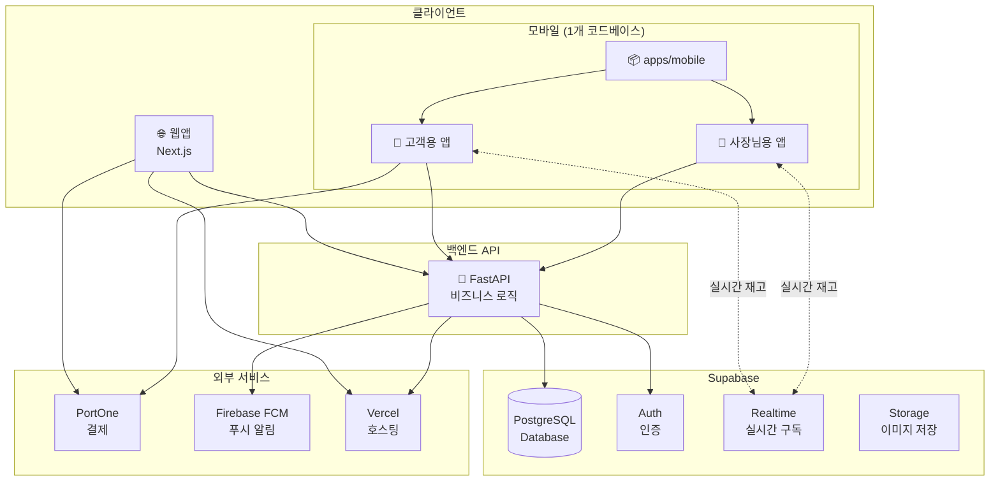
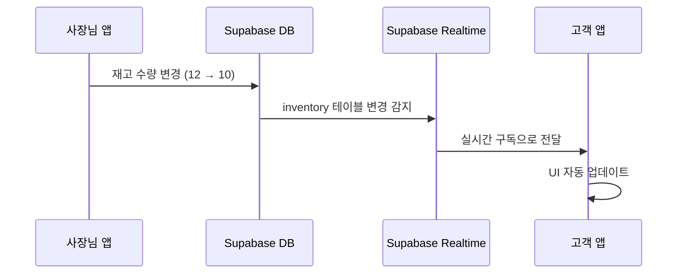
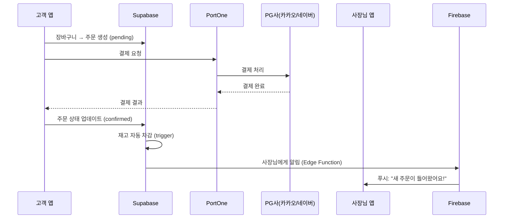
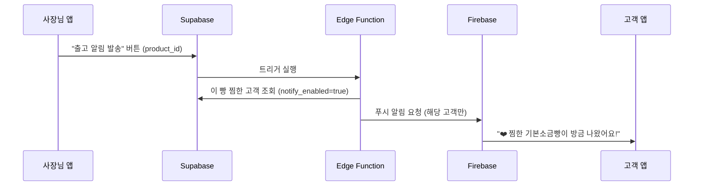
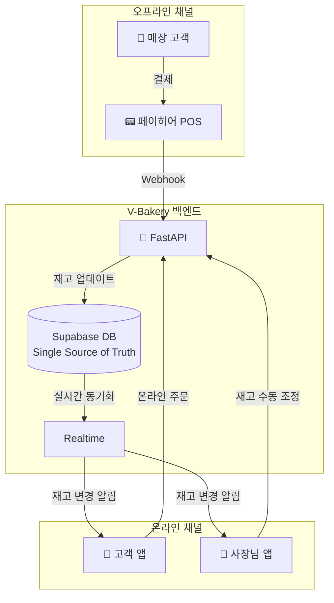
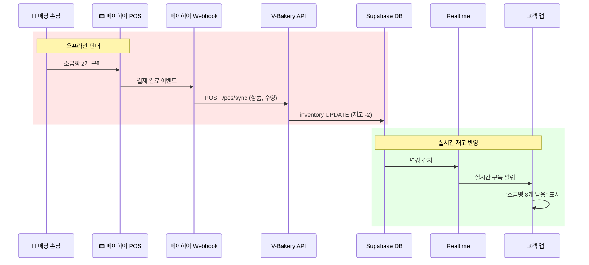
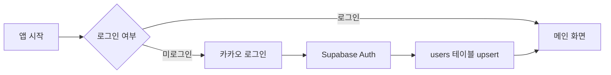
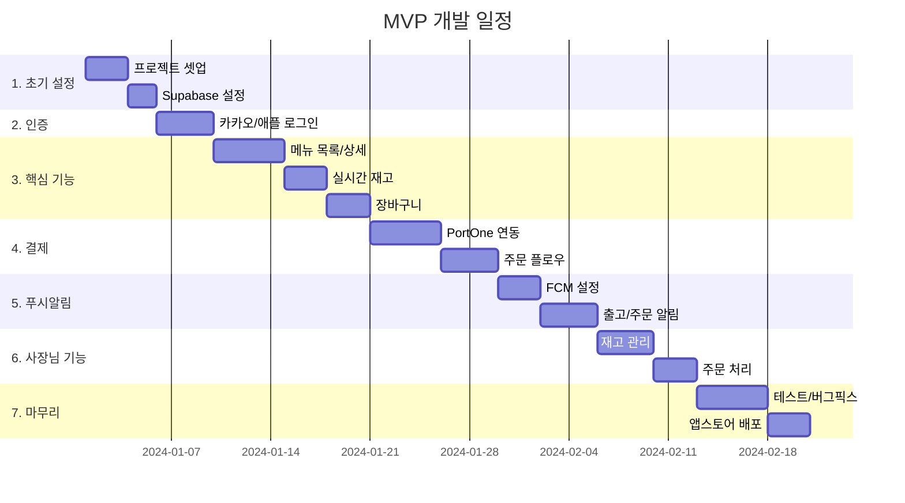

# 시스템 아키텍처 설계

> 비건 베이커리 앱 - 확정된 기술스택 기반 아키텍처

---

## ✅ 확정 사항

| **항목** | **결정** |
| --- | --- |
| 모바일 프레임워크 | **React Native (Expo)** |
| 백엔드 API | **FastAPI** |
| 데이터베이스/실시간 | **Supabase** |
| 개발 주체 | **직접 개발** |
| MVP 푸시알림 | **포함** (핵심 기능) |
| 개발 방향 | **독립 시스템** (포트폴리오 우선) |

---

## 🏗️ 시스템 아키텍처

### 앱 빌드 전략: 1개 코드베이스, 2개 앱

> **핵심**: React Native 코드베이스 하나로 **고객용 앱**과 **사장님용 앱** 2개를 빌드합니다.
> 코드 공유로 개발 효율성을 높이면서, 앱스토어에는 별도 앱으로 배포합니다.



### 역할 분담

| 담당 | FastAPI | Supabase |
|---|---|---|
| **주요 역할** | 비즈니스 로직 처리 | DB + 실시간 + 인증 |
| **처리 예시** | 주문 생성, 결제 검증, 푸시 발송 | 재고 실시간 동기화, 소셜 로그인 |
| **AI 확장** | Python 라이브러리로 AI 기능 추가 가능 | - |

---

## 📁 프로젝트 구조

```
bakery/
├── apps/
│   ├── web/                    # Next.js 웹앱
│   │   ├── src/
│   │   │   ├── app/           # App Router
│   │   │   ├── components/    # 공용 컴포넌트
│   │   │   ├── lib/           # 유틸리티
│   │   │   └── styles/        # CSS
│   │   └── package.json
│   │
│   └── mobile/                 # React Native (Expo) - 1개 코드베이스
│       ├── src/
│       │   ├── screens/
│       │   │   ├── customer/  # 👤 고객 전용 화면
│       │   │   │   ├── HomeScreen.tsx
│       │   │   │   ├── MenuScreen.tsx
│       │   │   │   ├── CartScreen.tsx
│       │   │   │   └── OrderScreen.tsx
│       │   │   ├── admin/     # 🏪 사장님 전용 화면
│       │   │   │   ├── DashboardScreen.tsx
│       │   │   │   ├── InventoryScreen.tsx
│       │   │   │   ├── OrderManageScreen.tsx
│       │   │   │   └── BreadDropScreen.tsx
│       │   │   └── shared/    # 🔗 공용 화면 (로그인 등)
│       │   │       ├── LoginScreen.tsx
│       │   │       └── ProfileScreen.tsx
│       │   ├── components/    # 공용 컴포넌트
│       │   ├── navigation/
│       │   │   ├── CustomerNavigator.tsx  # 고객 네비게이션
│       │   │   └── AdminNavigator.tsx     # 사장님 네비게이션
│       │   ├── hooks/         # 커스텀 훅
│       │   ├── services/      # API 호출, 푸시 등
│       │   ├── stores/        # 상태 관리 (Zustand)
│       │   └── utils/         # 유틸리티
│       │
│       ├── app.json           # 기본 설정 (공통)
│       ├── app.customer.json  # 📱 고객 앱 빌드 설정
│       ├── app.admin.json     # 📱 사장님 앱 빌드 설정
│       └── package.json
│
├── backend/                    # 🐍 FastAPI 백엔드
│   ├── app/
│   │   ├── main.py            # FastAPI 앱 진입점
│   │   ├── routers/           # API 라우터
│   │   │   ├── orders.py      # 주문 관련 API
│   │   │   ├── inventory.py   # 재고 관련 API
│   │   │   ├── payments.py    # 결제 검증 API
│   │   │   └── notifications.py # 푸시 알림 API
│   │   ├── services/          # 비즈니스 로직
│   │   │   ├── order_service.py
│   │   │   ├── payment_service.py
│   │   │   └── notification_service.py
│   │   ├── models/            # Pydantic 모델
│   │   └── utils/             # 유틸리티
│   ├── requirements.txt
│   └── Dockerfile
│
├── packages/
│   └── shared/                 # 공유 코드
│       ├── types/             # TypeScript 타입
│       ├── constants/         # 상수
│       └── utils/             # 공용 유틸리티
│
├── supabase/
│   ├── migrations/            # DB 마이그레이션
│   └── seed.sql               # 초기 데이터
│
└── docs/                       # 문서
```

### 빌드 명령어

```bash
# 고객용 앱 빌드
APP_VARIANT=customer npx expo build

# 사장님용 앱 빌드  
APP_VARIANT=admin npx expo build
```

---

## 🔄 핵심 데이터 플로우

### 1. 실시간 재고 업데이트



### 2. 주문 및 결제 플로우



### 3. 빵 출고 푸시 알림 (찜한 빵 기반)



---

## 🔗 [확장 옵션] 페이히어 POS 연동

> [!NOTE]
> **이 섹션은 선택적 확장 기능입니다.**
> 기본 개발은 V-Bakery **독립 시스템**으로 진행하며, 
> 실제 매장 적용 시 페이히어 연동을 추가할 수 있습니다.
> 연동 시 사장님 앱의 중복 기능(재고 관리, POS)은 제거됩니다.

> **핵심 가치**: 오프라인(페이히어 POS) ↔ 온라인(V-Bakery 앱) 실시간 재고 동기화로 
> "품절된 빵을 예약하는 문제"를 해결합니다.

### 연동 필요성

| 현재 문제 | V-Bakery 해결 방안 |
|---|---|
| 네이버 예약이 오프라인 재고와 연동 안 됨 | 단일 재고 DB로 오프라인/온라인 통합 |
| 오프라인 판매 후 온라인에 반영 지연 | 페이히어 Webhook으로 즉시 반영 |
| 품절 빵 예약 가능 | 실시간 재고 차감으로 방지 |

### 통합 아키텍처



### 실시간 재고 동기화 플로우



### API 연동 시나리오

> [!IMPORTANT]
> 페이히어 API 연동 가능 여부는 **페이히어 측 상담 후 확정**됩니다.

#### 시나리오 A: Webhook 연동 (권장)

페이히어에서 결제 완료 시 V-Bakery 서버로 Webhook 전송:

```python
# FastAPI - 페이히어 Webhook 수신 엔드포인트
@router.post("/pos/webhook")
async def receive_pos_webhook(payload: POSWebhookPayload):
    """
    페이히어 결제 완료 시 호출되는 Webhook
    - 판매 상품 정보 수신
    - 재고 자동 차감
    - pos_sync_logs 테이블에 기록
    """
    for item in payload.items:
        await update_inventory(
            product_id=item.product_id,
            quantity_change=-item.quantity
        )
    return {"status": "success"}
```

#### 시나리오 B: API Polling (대안)

주기적으로 페이히어 API에서 판매 데이터 조회:

```python
# 5분마다 페이히어 판매 데이터 동기화
@scheduler.task("every 5 minutes")
async def sync_pos_sales():
    sales = await payhere_api.get_recent_sales(since=last_sync_time)
    for sale in sales:
        await update_inventory_from_sale(sale)
```

### 대안 시나리오 (API 미제공 시)

> [!WARNING]
> 페이히어 API가 개별 매장에 제공되지 않을 경우 아래 대안을 고려합니다.

| 대안 | 설명 | 장단점 |
|---|---|---|
| **수동 동기화** | 사장님이 POS 판매 후 앱에서 재고 수동 조정 | 간단하지만 누락 가능성 |
| **일괄 동기화** | 마감 시 CSV 내보내기 후 업로드 | 실시간 아님, AI 분석용 |
| **POS 전환** | 토스 포스 등 API 지원 POS로 교체 | 근본적 해결, 전환 비용 발생 |

---

## 🗄️ 데이터베이스 스키마

### 테이블 목록

### 핵심 테이블 (MVP)

| **테이블** | **설명** | **실시간** |
| --- | --- | --- |
| `users` | 사용자 정보 | ❌ |
| `products` | 메뉴 정보 | ❌ |
| `categories` | 카테고리 | ❌ |
| `inventory` | 재고 현황 | ✅ |
| `orders` | 주문 정보 | ✅ |
| `order_items` | 주문 상세 | ❌ |
| `reviews` | **⭐ 사용자 리뷰** | ❌ |
| `user_favorites` | **찜한 빵 + 알림 설정** | ❌ |
| `notification_settings` | 알림 설정 | ❌ |
| `push_tokens` | FCM 토큰 | ❌ |

### AI 데이터 수집용 테이블 (MVP+)

| **테이블** | **설명** | **수집 시점** |
| --- | --- | --- |
| `user_events` | 사용자 행동 로그 | 실시간 |
| `production_logs` | 빵 생산/출고 기록 | 출고 시 |
| `daily_inventory_snapshot` | 일별 판매 스냅샷 | 마감 시 |
| `recipes` | 레시피/원재료 정보 | 수동 등록 |

### 인기 랭킹 뷰 (MVP)

> 오늘 판매량 기준 실시간 인기 빵 랭킹을 계산하는 뷰

```sql
-- 오늘 인기 빵 랭킹 뷰
CREATE VIEW popular_products_today AS
SELECT 
  p.id,
  p.name,
  p.price,
  p.image_url,
  i.quantity AS remaining_stock,
  COALESCE(SUM(oi.quantity), 0) AS sold_today,
  RANK() OVER (ORDER BY COALESCE(SUM(oi.quantity), 0) DESC) AS rank
FROM products p
LEFT JOIN inventory i ON i.product_id = p.id
LEFT JOIN order_items oi ON oi.product_id = p.id
LEFT JOIN orders o ON o.id = oi.order_id 
  AND DATE(o.created_at) = CURRENT_DATE
  AND o.status IN ('confirmed', 'preparing', 'ready', 'completed')
WHERE p.is_active = true
GROUP BY p.id, p.name, p.price, p.image_url, i.quantity
ORDER BY sold_today DESC;
```

### SQL 스키마

### 핵심 테이블

```sql
-- 사용자
CREATE TABLE users (
  id UUID PRIMARY KEY DEFAULT gen_random_uuid(),
  email TEXT UNIQUE,
  phone TEXT,
  name TEXT,
  role TEXT DEFAULT 'customer' CHECK (role IN ('customer', 'admin')),
  created_at TIMESTAMPTZ DEFAULT NOW()
);

-- 카테고리
CREATE TABLE categories (
  id UUID PRIMARY KEY DEFAULT gen_random_uuid(),
  name TEXT NOT NULL,
  sort_order INT DEFAULT 0
);

-- 메뉴
CREATE TABLE products (
  id UUID PRIMARY KEY DEFAULT gen_random_uuid(),
  category_id UUID REFERENCES categories(id),
  name TEXT NOT NULL,
  price INT NOT NULL,
  description TEXT,
  customer_preference TEXT, -- 👥 "직장인에게 인기", "수업 사이 간식으로 딱!"
  image_url TEXT,
  ingredients TEXT,
  allergens TEXT[],
  vegan_type TEXT DEFAULT 'vegan',
  schedule JSONB, -- {"times": ["08:00", "11:30"]}
  is_active BOOLEAN DEFAULT true,
  created_at TIMESTAMPTZ DEFAULT NOW()
);

-- 재고 (실시간)
CREATE TABLE inventory (
  id UUID PRIMARY KEY DEFAULT gen_random_uuid(),
  product_id UUID REFERENCES products(id) ON DELETE CASCADE,
  quantity INT DEFAULT 0,
  updated_at TIMESTAMPTZ DEFAULT NOW(),
  UNIQUE(product_id)
);

-- 주문
CREATE TABLE orders (
  id UUID PRIMARY KEY DEFAULT gen_random_uuid(),
  order_number TEXT UNIQUE NOT NULL,
  user_id UUID REFERENCES users(id),
  status TEXT DEFAULT 'pending' 
    CHECK (status IN ('pending', 'confirmed', 'preparing', 'ready', 'completed', 'cancelled')),
  total_amount INT NOT NULL,
  pickup_time TIMESTAMPTZ,
  payment_id TEXT, -- PortOne 결제 ID
  created_at TIMESTAMPTZ DEFAULT NOW()
);

-- 주문 상세
CREATE TABLE order_items (
  id UUID PRIMARY KEY DEFAULT gen_random_uuid(),
  order_id UUID REFERENCES orders(id) ON DELETE CASCADE,
  product_id UUID REFERENCES products(id),
  quantity INT NOT NULL,
  price INT NOT NULL
);

-- 알림 설정
CREATE TABLE notification_settings (
  id UUID PRIMARY KEY DEFAULT gen_random_uuid(),
  user_id UUID REFERENCES users(id) ON DELETE CASCADE,
  baking_alert BOOLEAN DEFAULT true,
  discount_alert BOOLEAN DEFAULT true,
  favorite_products UUID[], -- 관심 빵 ID 목록
  UNIQUE(user_id)
);

-- FCM 토큰
CREATE TABLE push_tokens (
  id UUID PRIMARY KEY DEFAULT gen_random_uuid(),
  user_id UUID REFERENCES users(id) ON DELETE CASCADE,
  token TEXT NOT NULL,
  platform TEXT CHECK (platform IN ('ios', 'android', 'web')),
  created_at TIMESTAMPTZ DEFAULT NOW(),
  UNIQUE(user_id, token)
);

-- 찜한 빵 (개인화 알림용)
CREATE TABLE user_favorites (
  id UUID PRIMARY KEY DEFAULT gen_random_uuid(),
  user_id UUID REFERENCES users(id) ON DELETE CASCADE,
  product_id UUID REFERENCES products(id) ON DELETE CASCADE,
  notify_enabled BOOLEAN DEFAULT true, -- 이 빵 출고 시 알림 받을지
  created_at TIMESTAMPTZ DEFAULT NOW(),
  UNIQUE(user_id, product_id)
);

-- ⭐ 사용자 리뷰
CREATE TABLE reviews (
  id UUID PRIMARY KEY DEFAULT gen_random_uuid(),
  user_id UUID REFERENCES users(id) ON DELETE CASCADE,
  product_id UUID REFERENCES products(id) ON DELETE CASCADE,
  order_id UUID REFERENCES orders(id), -- 실제 구매 후 리뷰 (선택)
  rating INT NOT NULL CHECK (rating >= 1 AND rating <= 5), -- 1~5점
  content TEXT, -- 리뷰 내용
  helpful_count INT DEFAULT 0, -- 도움이 됐어요 수
  is_best BOOLEAN DEFAULT false, -- 베스트 리뷰 여부 (관리자 지정)
  created_at TIMESTAMPTZ DEFAULT NOW(),
  UNIQUE(user_id, product_id, order_id) -- 주문당 1개 리뷰
);

-- 리뷰 도움됐어요 기록
CREATE TABLE review_helpful (
  id UUID PRIMARY KEY DEFAULT gen_random_uuid(),
  review_id UUID REFERENCES reviews(id) ON DELETE CASCADE,
  user_id UUID REFERENCES users(id) ON DELETE CASCADE,
  created_at TIMESTAMPTZ DEFAULT NOW(),
  UNIQUE(review_id, user_id)
);

-- 베스트 리뷰 뷰 (상품별 최고 리뷰)
CREATE VIEW best_reviews AS
SELECT 
  r.*,
  u.name AS user_name,
  p.name AS product_name
FROM reviews r
JOIN users u ON u.id = r.user_id
JOIN products p ON p.id = r.product_id
WHERE r.is_best = true OR r.helpful_count >= 10
ORDER BY r.is_best DESC, r.helpful_count DESC, r.rating DESC;
```

### AI 데이터 수집용 테이블

```sql
-- 사용자 행동 이벤트 (앱 사용 패턴 분석)
CREATE TABLE user_events (
  id UUID PRIMARY KEY DEFAULT gen_random_uuid(),
  user_id UUID REFERENCES users(id),
  event_type TEXT NOT NULL,
    -- 'app_open', 'view_product', 'add_cart', 'drop_waiting',
    -- 'pre_order', 'push_click', 'search'
  product_id UUID REFERENCES products(id),
  metadata JSONB, -- 추가 정보 (검색어, 대기시간 등)
  created_at TIMESTAMPTZ DEFAULT NOW()
);

-- 생산/출고 기록 (사장님이 출고 시 등록)
CREATE TABLE production_logs (
  id UUID PRIMARY KEY DEFAULT gen_random_uuid(),
  product_id UUID REFERENCES products(id),
  quantity INT NOT NULL, -- 생산 수량
  produced_at TIMESTAMPTZ, -- 출고 시간
  batch_number INT DEFAULT 1, -- 몇 차 출고인지 (1차, 2차)
  created_at TIMESTAMPTZ DEFAULT NOW()
);

-- 일별 판매 스냅샷 (마감 시 자동 저장)
CREATE TABLE daily_inventory_snapshot (
  id UUID PRIMARY KEY DEFAULT gen_random_uuid(),
  product_id UUID REFERENCES products(id),
  date DATE NOT NULL,
  produced_qty INT DEFAULT 0, -- 당일 생산량
  sold_qty INT DEFAULT 0, -- 당일 판매량
  remaining_qty INT DEFAULT 0, -- 마감 시 잔여량
  soldout_at TIMESTAMPTZ, -- 품절 시각 (NULL이면 품절 안됨)
  created_at TIMESTAMPTZ DEFAULT NOW(),
  UNIQUE(product_id, date)
);

-- 레시피 (원재료 정보 - 발주 계산용)
CREATE TABLE recipes (
  id UUID PRIMARY KEY DEFAULT gen_random_uuid(),
  product_id UUID REFERENCES products(id),
  ingredient_name TEXT NOT NULL, -- 원재료명 (밀가루, 비건버터 등)
  quantity DECIMAL NOT NULL, -- 필요량
  unit TEXT NOT NULL, -- 단위 ('g', 'ml', '개')
  created_at TIMESTAMPTZ DEFAULT NOW()
);

-- 원재료 재고 (발주 관리용 - Phase 3)
CREATE TABLE ingredient_inventory (
  id UUID PRIMARY KEY DEFAULT gen_random_uuid(),
  ingredient_name TEXT UNIQUE NOT NULL,
  current_stock DECIMAL DEFAULT 0,
  unit TEXT NOT NULL,
  reorder_point DECIMAL, -- 재주문 기준점
  supplier TEXT,
  updated_at TIMESTAMPTZ DEFAULT NOW()
);
```

### 주요 트리거

```sql
-- 주문 확정 시 재고 자동 차감
CREATE OR REPLACE FUNCTION decrease_inventory()
RETURNS TRIGGER AS $$
BEGIN
  IF NEW.status = 'confirmed' AND OLD.status = 'pending' THEN
    UPDATE inventory i
    SET quantity = quantity - oi.quantity,
        updated_at = NOW()
    FROM order_items oi
    WHERE oi.order_id = NEW.id AND i.product_id = oi.product_id;
  END IF;
  RETURN NEW;
END;
$$ LANGUAGE plpgsql;

CREATE TRIGGER on_order_confirmed
  AFTER UPDATE ON orders
  FOR EACH ROW
  EXECUTE FUNCTION decrease_inventory();

-- 일별 스냅샷 저장 함수 (Edge Function에서 호출)
CREATE OR REPLACE FUNCTION save_daily_snapshot()
RETURNS void AS $$
BEGIN
  INSERT INTO daily_inventory_snapshot 
    (product_id, date, produced_qty, sold_qty, remaining_qty, soldout_at)
  SELECT 
    p.id,
    CURRENT_DATE,
    COALESCE(SUM(pl.quantity), 0) as produced,
    COALESCE(
      (SELECT SUM(oi.quantity) 
       FROM order_items oi 
       JOIN orders o ON o.id = oi.order_id 
       WHERE oi.product_id = p.id 
       AND DATE(o.created_at) = CURRENT_DATE
       AND o.status IN ('confirmed', 'preparing', 'ready', 'completed')), 0
    ) as sold,
    i.quantity as remaining,
    NULL -- soldout_at은 별도 트리거로 기록
  FROM products p
  LEFT JOIN inventory i ON i.product_id = p.id
  LEFT JOIN production_logs pl ON pl.product_id = p.id 
    AND DATE(pl.produced_at) = CURRENT_DATE
  WHERE p.is_active = true
  GROUP BY p.id, i.quantity
  ON CONFLICT (product_id, date) 
  DO UPDATE SET 
    produced_qty = EXCLUDED.produced_qty,
    sold_qty = EXCLUDED.sold_qty,
    remaining_qty = EXCLUDED.remaining_qty;
END;
$$ LANGUAGE plpgsql;
```

---

## 🔐 인증 구조



### 소셜 로그인

- **카카오 로그인**: 주 타겟 (대학생)
- **애플 로그인**: iOS 필수 (앱스토어 정책)

---

## 📱 React Native 핵심 라이브러리

| **용도** | **라이브러리** |
| --- | --- |
| 프레임워크 | Expo (managed) |
| 네비게이션 | expo-router |
| 상태관리 | Zustand |
| API/캐싱 | TanStack Query |
| Supabase | @supabase/supabase-js |
| 결제 | iamport-react-native |
| 푸시 | expo-notifications + FCM |
| UI 컴포넌트 | NativeWind (Tailwind) |

---

## 🌐 환경 변수

```env
# Supabase
EXPO_PUBLIC_SUPABASE_URL=https://xxx.supabase.co
EXPO_PUBLIC_SUPABASE_ANON_KEY=xxx

# PortOne
EXPO_PUBLIC_PORTONE_STORE_ID=xxx
EXPO_PUBLIC_PORTONE_CHANNEL_KEY=xxx

# Firebase (for FCM)
# google-services.json (Android)
# GoogleService-Info.plist (iOS)
```

---

## 📅 MVP 개발 일정 (8주)



### 주차별 마일스톤

| **주차** | **목표** | **산출물** |
| --- | --- | --- |
| 1주 | 프로젝트 셋업, DB 설계 | Expo 프로젝트, Supabase 테이블 |
| 2주 | 인증 구현 | 카카오/애플 로그인 동작 |
| 3주 | 메뉴/재고 기능 | 메뉴 목록, 상세, 실시간 재고 |
| 4주 | 장바구니, 결제 연동 | PortOne 결제 테스트 통과 |
| 5주 | 주문 플로우 완성 | 주문 생성 → 픽업 완료 |
| 6주 | 푸시알림 | 출고/주문 알림 동작 |
| 7주 | 사장님 기능 | 재고 관리, 주문 처리 |
| 8주 | 테스트, 배포 | 앱스토어 심사 제출 |

---

## 🚀 다음 단계

- [ ] UI/UX 와이어프레임 설계
- [ ] Expo 프로젝트 초기화
- [ ] Supabase 프로젝트 생성 및 스키마 적용
