# 시스템 아키텍처 설계

> 비건 베이커리 앱 - 확정된 기술스택 기반 아키텍처

---

## ✅ 확정 사항

| **항목** | **결정** |
| --- | --- |
| 모바일 프레임워크 | **React Native (Expo)** |
| 백엔드 API | **FastAPI** |
| 데이터베이스/실시간 | **Supabase** |
| 개발 주체 | **직접 개발** |
| MVP 푸시알림 | **포함** (핵심 기능) |

---

## 🏗️ 시스템 아키텍처

### 앱 빌드 전략: 1개 코드베이스, 2개 앱

> **핵심**: React Native 코드베이스 하나로 **고객용 앱**과 **사장님용 앱** 2개를 빌드합니다.
> 코드 공유로 개발 효율성을 높이면서, 앱스토어에는 별도 앱으로 배포합니다.

```mermaid
graph TB
    subgraph "클라이언트"
        A[🌐 웹앱<br/>Next.js]
        subgraph "모바일 (1개 코드베이스)"
            M[📦 apps/mobile]
            M --> B[📱 고객용 앱]
            M --> C[📱 사장님용 앱]
        end
    end
    
    subgraph "백엔드 API"
        API[🐍 FastAPI<br/>비즈니스 로직]
    end
    
    subgraph "Supabase"
        D[(PostgreSQL<br/>Database)]
        E[Auth<br/>인증]
        F[Realtime<br/>실시간 구독]
        G[Storage<br/>이미지 저장]
    end
    
    subgraph "외부 서비스"
        I[PortOne<br/>결제]
        J[Firebase FCM<br/>푸시 알림]
        K[Vercel<br/>호스팅]
    end
    
    A --> API
    B --> API
    C --> API
    B <-.->|실시간 재고| F
    C <-.->|실시간 재고| F
    
    API --> D
    API --> E
    API --> J
    
    A --> I
    B --> I
    A --> K
    API --> K
```



### 역할 분담

| 담당 | FastAPI | Supabase |
|---|---|---|
| **주요 역할** | 비즈니스 로직 처리 | DB + 실시간 + 인증 |
| **처리 예시** | 주문 생성, 결제 검증, 푸시 발송 | 재고 실시간 동기화, 소셜 로그인 |
| **AI 확장** | Python 라이브러리로 AI 기능 추가 가능 | - |

---

## 📁 프로젝트 구조

```
bakery/
├── apps/
│   ├── web/                    # Next.js 웹앱
│   │   ├── src/
│   │   │   ├── app/           # App Router
│   │   │   ├── components/    # 공용 컴포넌트
│   │   │   ├── lib/           # 유틸리티
│   │   │   └── styles/        # CSS
│   │   └── package.json
│   │
│   └── mobile/                 # React Native (Expo) - 1개 코드베이스
│       ├── src/
│       │   ├── screens/
│       │   │   ├── customer/  # 👤 고객 전용 화면
│       │   │   │   ├── HomeScreen.tsx
│       │   │   │   ├── MenuScreen.tsx
│       │   │   │   ├── CartScreen.tsx
│       │   │   │   └── OrderScreen.tsx
│       │   │   ├── admin/     # 🏪 사장님 전용 화면
│       │   │   │   ├── DashboardScreen.tsx
│       │   │   │   ├── InventoryScreen.tsx
│       │   │   │   ├── OrderManageScreen.tsx
│       │   │   │   └── BreadDropScreen.tsx
│       │   │   └── shared/    # 🔗 공용 화면 (로그인 등)
│       │   │       ├── LoginScreen.tsx
│       │   │       └── ProfileScreen.tsx
│       │   ├── components/    # 공용 컴포넌트
│       │   ├── navigation/
│       │   │   ├── CustomerNavigator.tsx  # 고객 네비게이션
│       │   │   └── AdminNavigator.tsx     # 사장님 네비게이션
│       │   ├── hooks/         # 커스텀 훅
│       │   ├── services/      # API 호출, 푸시 등
│       │   ├── stores/        # 상태 관리 (Zustand)
│       │   └── utils/         # 유틸리티
│       │
│       ├── app.json           # 기본 설정 (공통)
│       ├── app.customer.json  # 📱 고객 앱 빌드 설정
│       ├── app.admin.json     # 📱 사장님 앱 빌드 설정
│       └── package.json
│
├── backend/                    # 🐍 FastAPI 백엔드
│   ├── app/
│   │   ├── main.py            # FastAPI 앱 진입점
│   │   ├── routers/           # API 라우터
│   │   │   ├── orders.py      # 주문 관련 API
│   │   │   ├── inventory.py   # 재고 관련 API
│   │   │   ├── payments.py    # 결제 검증 API
│   │   │   └── notifications.py # 푸시 알림 API
│   │   ├── services/          # 비즈니스 로직
│   │   │   ├── order_service.py
│   │   │   ├── payment_service.py
│   │   │   └── notification_service.py
│   │   ├── models/            # Pydantic 모델
│   │   └── utils/             # 유틸리티
│   ├── requirements.txt
│   └── Dockerfile
│
├── packages/
│   └── shared/                 # 공유 코드
│       ├── types/             # TypeScript 타입
│       ├── constants/         # 상수
│       └── utils/             # 공용 유틸리티
│
├── supabase/
│   ├── migrations/            # DB 마이그레이션
│   └── seed.sql               # 초기 데이터
│
└── docs/                       # 문서
```

### 빌드 명령어

```bash
# 고객용 앱 빌드
APP_VARIANT=customer npx expo build

# 사장님용 앱 빌드  
APP_VARIANT=admin npx expo build
```

---

## 🔄 핵심 데이터 플로우

### 1. 실시간 재고 업데이트

```mermaid
sequenceDiagram
    participant Admin as 사장님 앱
    participant DB as Supabase DB
    participant RT as Supabase Realtime
    participant Customer as 고객 앱
    
    Admin->>DB: 재고 수량 변경 (12 → 10)
    DB->>RT: inventory 테이블 변경 감지
    RT->>Customer: 실시간 구독으로 전달
    Customer->>Customer: UI 자동 업데이트
```



### 2. 주문 및 결제 플로우

```mermaid
sequenceDiagram
    participant C as 고객 앱
    participant DB as Supabase
    participant P as PortOne
    participant PG as PG사(카카오/네이버)
    participant A as 사장님 앱
    participant FCM as Firebase
    
    C->>DB: 장바구니 → 주문 생성 (pending)
    C->>P: 결제 요청
    P->>PG: 결제 처리
    PG-->>P: 결제 완료
    P-->>C: 결제 결과
    C->>DB: 주문 상태 업데이트 (confirmed)
    DB->>DB: 재고 자동 차감 (trigger)
    DB->>FCM: 사장님에게 알림 (Edge Function)
    FCM->>A: 푸시: "새 주문이 들어왔어요!"
```



### 3. 빵 출고 푸시 알림 (찜한 빵 기반)

```mermaid
sequenceDiagram
    participant A as 사장님 앱
    participant DB as Supabase
    participant EF as Edge Function
    participant FCM as Firebase
    participant C as 고객 앱
    
    A->>DB: "출고 알림 발송" 버튼 (product_id)
    DB->>EF: 트리거 실행
    EF->>DB: 이 빵 찜한 고객 조회 (notify_enabled=true)
    EF->>FCM: 푸시 알림 요청 (해당 고객만)
    FCM->>C: "❤️ 찜한 기본소금빵이 방금 나왔어요!"
```



---

## 🗄️ 데이터베이스 스키마

### 테이블 목록

### 핵심 테이블 (MVP)

| **테이블** | **설명** | **실시간** |
| --- | --- | --- |
| `users` | 사용자 정보 | ❌ |
| `products` | 메뉴 정보 | ❌ |
| `categories` | 카테고리 | ❌ |
| `inventory` | 재고 현황 | ✅ |
| `orders` | 주문 정보 | ✅ |
| `order_items` | 주문 상세 | ❌ |
| `user_favorites` | **찜한 빵 + 알림 설정** | ❌ |
| `notification_settings` | 알림 설정 | ❌ |
| `push_tokens` | FCM 토큰 | ❌ |

### AI 데이터 수집용 테이블 (MVP+)

| **테이블** | **설명** | **수집 시점** |
| --- | --- | --- |
| `user_events` | 사용자 행동 로그 | 실시간 |
| `production_logs` | 빵 생산/출고 기록 | 출고 시 |
| `daily_inventory_snapshot` | 일별 판매 스냅샷 | 마감 시 |
| `recipes` | 레시피/원재료 정보 | 수동 등록 |

### SQL 스키마

### 핵심 테이블

```sql
-- 사용자
CREATE TABLE users (
  id UUID PRIMARY KEY DEFAULT gen_random_uuid(),
  email TEXT UNIQUE,
  phone TEXT,
  name TEXT,
  role TEXT DEFAULT 'customer' CHECK (role IN ('customer', 'admin')),
  created_at TIMESTAMPTZ DEFAULT NOW()
);

-- 카테고리
CREATE TABLE categories (
  id UUID PRIMARY KEY DEFAULT gen_random_uuid(),
  name TEXT NOT NULL,
  sort_order INT DEFAULT 0
);

-- 메뉴
CREATE TABLE products (
  id UUID PRIMARY KEY DEFAULT gen_random_uuid(),
  category_id UUID REFERENCES categories(id),
  name TEXT NOT NULL,
  price INT NOT NULL,
  description TEXT,
  image_url TEXT,
  ingredients TEXT,
  allergens TEXT[],
  vegan_type TEXT DEFAULT 'vegan',
  schedule JSONB, -- {"times": ["08:00", "11:30"]}
  is_active BOOLEAN DEFAULT true,
  created_at TIMESTAMPTZ DEFAULT NOW()
);

-- 재고 (실시간)
CREATE TABLE inventory (
  id UUID PRIMARY KEY DEFAULT gen_random_uuid(),
  product_id UUID REFERENCES products(id) ON DELETE CASCADE,
  quantity INT DEFAULT 0,
  updated_at TIMESTAMPTZ DEFAULT NOW(),
  UNIQUE(product_id)
);

-- 주문
CREATE TABLE orders (
  id UUID PRIMARY KEY DEFAULT gen_random_uuid(),
  order_number TEXT UNIQUE NOT NULL,
  user_id UUID REFERENCES users(id),
  status TEXT DEFAULT 'pending' 
    CHECK (status IN ('pending', 'confirmed', 'preparing', 'ready', 'completed', 'cancelled')),
  total_amount INT NOT NULL,
  pickup_time TIMESTAMPTZ,
  payment_id TEXT, -- PortOne 결제 ID
  created_at TIMESTAMPTZ DEFAULT NOW()
);

-- 주문 상세
CREATE TABLE order_items (
  id UUID PRIMARY KEY DEFAULT gen_random_uuid(),
  order_id UUID REFERENCES orders(id) ON DELETE CASCADE,
  product_id UUID REFERENCES products(id),
  quantity INT NOT NULL,
  price INT NOT NULL
);

-- 알림 설정
CREATE TABLE notification_settings (
  id UUID PRIMARY KEY DEFAULT gen_random_uuid(),
  user_id UUID REFERENCES users(id) ON DELETE CASCADE,
  baking_alert BOOLEAN DEFAULT true,
  discount_alert BOOLEAN DEFAULT true,
  favorite_products UUID[], -- 관심 빵 ID 목록
  UNIQUE(user_id)
);

-- FCM 토큰
CREATE TABLE push_tokens (
  id UUID PRIMARY KEY DEFAULT gen_random_uuid(),
  user_id UUID REFERENCES users(id) ON DELETE CASCADE,
  token TEXT NOT NULL,
  platform TEXT CHECK (platform IN ('ios', 'android', 'web')),
  created_at TIMESTAMPTZ DEFAULT NOW(),
  UNIQUE(user_id, token)
);

-- 찜한 빵 (개인화 알림용)
CREATE TABLE user_favorites (
  id UUID PRIMARY KEY DEFAULT gen_random_uuid(),
  user_id UUID REFERENCES users(id) ON DELETE CASCADE,
  product_id UUID REFERENCES products(id) ON DELETE CASCADE,
  notify_enabled BOOLEAN DEFAULT true, -- 이 빵 출고 시 알림 받을지
  created_at TIMESTAMPTZ DEFAULT NOW(),
  UNIQUE(user_id, product_id)
);
```

### AI 데이터 수집용 테이블

```sql
-- 사용자 행동 이벤트 (앱 사용 패턴 분석)
CREATE TABLE user_events (
  id UUID PRIMARY KEY DEFAULT gen_random_uuid(),
  user_id UUID REFERENCES users(id),
  event_type TEXT NOT NULL,
    -- 'app_open', 'view_product', 'add_cart', 'drop_waiting',
    -- 'pre_order', 'push_click', 'search'
  product_id UUID REFERENCES products(id),
  metadata JSONB, -- 추가 정보 (검색어, 대기시간 등)
  created_at TIMESTAMPTZ DEFAULT NOW()
);

-- 생산/출고 기록 (사장님이 출고 시 등록)
CREATE TABLE production_logs (
  id UUID PRIMARY KEY DEFAULT gen_random_uuid(),
  product_id UUID REFERENCES products(id),
  quantity INT NOT NULL, -- 생산 수량
  produced_at TIMESTAMPTZ, -- 출고 시간
  batch_number INT DEFAULT 1, -- 몇 차 출고인지 (1차, 2차)
  created_at TIMESTAMPTZ DEFAULT NOW()
);

-- 일별 판매 스냅샷 (마감 시 자동 저장)
CREATE TABLE daily_inventory_snapshot (
  id UUID PRIMARY KEY DEFAULT gen_random_uuid(),
  product_id UUID REFERENCES products(id),
  date DATE NOT NULL,
  produced_qty INT DEFAULT 0, -- 당일 생산량
  sold_qty INT DEFAULT 0, -- 당일 판매량
  remaining_qty INT DEFAULT 0, -- 마감 시 잔여량
  soldout_at TIMESTAMPTZ, -- 품절 시각 (NULL이면 품절 안됨)
  created_at TIMESTAMPTZ DEFAULT NOW(),
  UNIQUE(product_id, date)
);

-- 레시피 (원재료 정보 - 발주 계산용)
CREATE TABLE recipes (
  id UUID PRIMARY KEY DEFAULT gen_random_uuid(),
  product_id UUID REFERENCES products(id),
  ingredient_name TEXT NOT NULL, -- 원재료명 (밀가루, 비건버터 등)
  quantity DECIMAL NOT NULL, -- 필요량
  unit TEXT NOT NULL, -- 단위 ('g', 'ml', '개')
  created_at TIMESTAMPTZ DEFAULT NOW()
);

-- 원재료 재고 (발주 관리용 - Phase 3)
CREATE TABLE ingredient_inventory (
  id UUID PRIMARY KEY DEFAULT gen_random_uuid(),
  ingredient_name TEXT UNIQUE NOT NULL,
  current_stock DECIMAL DEFAULT 0,
  unit TEXT NOT NULL,
  reorder_point DECIMAL, -- 재주문 기준점
  supplier TEXT,
  updated_at TIMESTAMPTZ DEFAULT NOW()
);
```

### 주요 트리거

```sql
-- 주문 확정 시 재고 자동 차감
CREATE OR REPLACE FUNCTION decrease_inventory()
RETURNS TRIGGER AS $$
BEGIN
  IF NEW.status = 'confirmed' AND OLD.status = 'pending' THEN
    UPDATE inventory i
    SET quantity = quantity - oi.quantity,
        updated_at = NOW()
    FROM order_items oi
    WHERE oi.order_id = NEW.id AND i.product_id = oi.product_id;
  END IF;
  RETURN NEW;
END;
$$ LANGUAGE plpgsql;

CREATE TRIGGER on_order_confirmed
  AFTER UPDATE ON orders
  FOR EACH ROW
  EXECUTE FUNCTION decrease_inventory();

-- 일별 스냅샷 저장 함수 (Edge Function에서 호출)
CREATE OR REPLACE FUNCTION save_daily_snapshot()
RETURNS void AS $$
BEGIN
  INSERT INTO daily_inventory_snapshot 
    (product_id, date, produced_qty, sold_qty, remaining_qty, soldout_at)
  SELECT 
    p.id,
    CURRENT_DATE,
    COALESCE(SUM(pl.quantity), 0) as produced,
    COALESCE(
      (SELECT SUM(oi.quantity) 
       FROM order_items oi 
       JOIN orders o ON o.id = oi.order_id 
       WHERE oi.product_id = p.id 
       AND DATE(o.created_at) = CURRENT_DATE
       AND o.status IN ('confirmed', 'preparing', 'ready', 'completed')), 0
    ) as sold,
    i.quantity as remaining,
    NULL -- soldout_at은 별도 트리거로 기록
  FROM products p
  LEFT JOIN inventory i ON i.product_id = p.id
  LEFT JOIN production_logs pl ON pl.product_id = p.id 
    AND DATE(pl.produced_at) = CURRENT_DATE
  WHERE p.is_active = true
  GROUP BY p.id, i.quantity
  ON CONFLICT (product_id, date) 
  DO UPDATE SET 
    produced_qty = EXCLUDED.produced_qty,
    sold_qty = EXCLUDED.sold_qty,
    remaining_qty = EXCLUDED.remaining_qty;
END;
$$ LANGUAGE plpgsql;
```

---

## 🔐 인증 구조

```mermaid
graph LR
    A[앱 시작] --> B{로그인 여부}
    B -->|미로그인| C[카카오 로그인]
    B -->|로그인| D[메인 화면]
    C --> E[Supabase Auth]
    E --> F[users 테이블 upsert]
    F --> D
```



### 소셜 로그인

- **카카오 로그인**: 주 타겟 (대학생)
- **애플 로그인**: iOS 필수 (앱스토어 정책)

---

## 📱 React Native 핵심 라이브러리

| **용도** | **라이브러리** |
| --- | --- |
| 프레임워크 | Expo (managed) |
| 네비게이션 | expo-router |
| 상태관리 | Zustand |
| API/캐싱 | TanStack Query |
| Supabase | @supabase/supabase-js |
| 결제 | iamport-react-native |
| 푸시 | expo-notifications + FCM |
| UI 컴포넌트 | NativeWind (Tailwind) |

---

## 🌐 환경 변수

```env
# Supabase
EXPO_PUBLIC_SUPABASE_URL=https://xxx.supabase.co
EXPO_PUBLIC_SUPABASE_ANON_KEY=xxx

# PortOne
EXPO_PUBLIC_PORTONE_STORE_ID=xxx
EXPO_PUBLIC_PORTONE_CHANNEL_KEY=xxx

# Firebase (for FCM)
# google-services.json (Android)
# GoogleService-Info.plist (iOS)
```

---

## 📅 MVP 개발 일정 (8주)

```mermaid
gantt
    title MVP 개발 일정
    dateFormat  YYYY-MM-DD
    
    section 1. 초기 설정
    프로젝트 셋업       :a1, 2024-01-01, 3d
    Supabase 설정       :a2, after a1, 2d
    
    section 2. 인증
    카카오/애플 로그인  :b1, after a2, 4d
    
    section 3. 핵심 기능
    메뉴 목록/상세      :c1, after b1, 5d
    실시간 재고         :c2, after c1, 3d
    장바구니            :c3, after c2, 3d
    
    section 4. 결제
    PortOne 연동        :d1, after c3, 5d
    주문 플로우         :d2, after d1, 4d
    
    section 5. 푸시알림
    FCM 설정            :e1, after d2, 3d
    출고/주문 알림      :e2, after e1, 4d
    
    section 6. 사장님 기능
    재고 관리           :f1, after e2, 4d
    주문 처리           :f2, after f1, 3d
    
    section 7. 마무리
    테스트/버그픽스     :g1, after f2, 5d
    앱스토어 배포       :g2, after g1, 3d
```



### 주차별 마일스톤

| **주차** | **목표** | **산출물** |
| --- | --- | --- |
| 1주 | 프로젝트 셋업, DB 설계 | Expo 프로젝트, Supabase 테이블 |
| 2주 | 인증 구현 | 카카오/애플 로그인 동작 |
| 3주 | 메뉴/재고 기능 | 메뉴 목록, 상세, 실시간 재고 |
| 4주 | 장바구니, 결제 연동 | PortOne 결제 테스트 통과 |
| 5주 | 주문 플로우 완성 | 주문 생성 → 픽업 완료 |
| 6주 | 푸시알림 | 출고/주문 알림 동작 |
| 7주 | 사장님 기능 | 재고 관리, 주문 처리 |
| 8주 | 테스트, 배포 | 앱스토어 심사 제출 |

---

## 🚀 다음 단계

- [ ] UI/UX 와이어프레임 설계
- [ ] Expo 프로젝트 초기화
- [ ] Supabase 프로젝트 생성 및 스키마 적용
