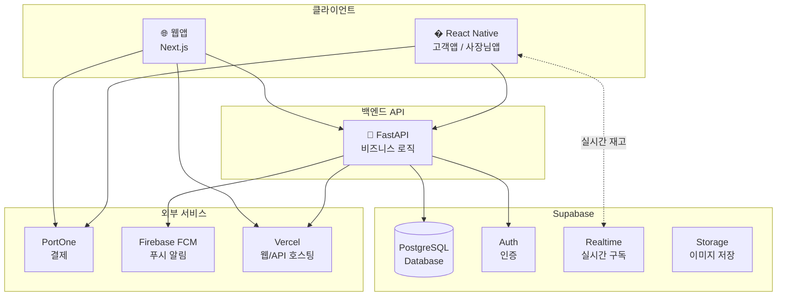
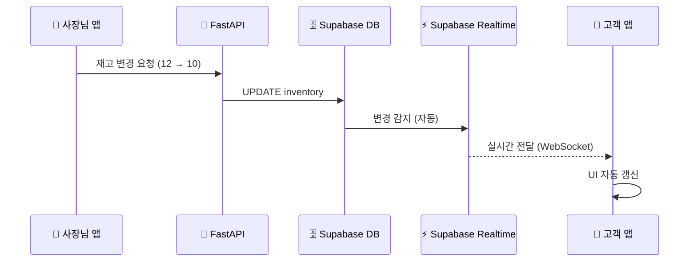

# 기술스택 분석 및 선정

> Phase 2: 비용효율성과 트레이드오프를 고려한 기술스택 검토
> **확정**: FastAPI + Supabase 조합

---

## ✅ 확정 사항

| **항목** | **결정** | **이유** |
|---|---|---|
| 모바일 프레임워크 | **React Native (Expo)** | 1개 코드베이스, 2개 앱 빌드 |
| 백엔드 API | **FastAPI** | Python 경험 활용 |
| 데이터베이스 | **Supabase** | PostgreSQL + 실시간 기능 내장 |
| 개발 주체 | **직접 개발** | - |

---

## 📋 선정 기준

| **기준** | **가중치** | **설명** |
| --- | --- | --- |
| **비용효율성** | ⭐⭐⭐ | 초기/운영 비용 최소화 |
| **개발 속도** | ⭐⭐⭐ | MVP 빠른 출시 |
| **실시간 기능** | ⭐⭐⭐ | 빵드롭 핵심 기능 |
| **유지보수성** | ⭐⭐ | 장기 운영 용이성 |
| **확장성** | ⭐⭐ | 향후 AI 기능 추가 대응 |

---

## 🏗️ 최종 아키텍처: FastAPI + Supabase



### 역할 분담

| 담당 | FastAPI | Supabase |
|---|---|---|
| **역할** | 비즈니스 로직 처리 | DB + 실시간 + 인증 |
| **처리 예시** | 주문 생성, 결제 검증, 푸시 발송, AI 추천 | 재고 실시간 동기화, 소셜 로그인 |
| **장점** | Python 경험 활용, 복잡한 로직 처리 | 실시간 기능 즉시 사용, 관리 불필요 |

---

## 🔄 실시간 데이터 플로우

빵드롭의 핵심 기능인 **실시간 재고 업데이트** 구현 방식:



### 코드 예시

**FastAPI (재고 변경 API)**
```python
from fastapi import FastAPI
from supabase import create_client

app = FastAPI()
supabase = create_client(SUPABASE_URL, SUPABASE_KEY)

@app.patch("/inventory/{product_id}")
async def update_inventory(product_id: str, quantity: int):
    # DB 업데이트만 하면 Realtime이 자동 처리!
    result = supabase.table("inventory").update({
        "quantity": quantity,
        "updated_at": "now()"
    }).eq("product_id", product_id).execute()
    
    return {"status": "updated", "new_quantity": quantity}
```

**React Native (실시간 구독)**
```typescript
// 재고 변경 구독
supabase
  .channel('inventory-changes')
  .on('postgres_changes', {
    event: 'UPDATE',
    schema: 'public',
    table: 'inventory'
  }, (payload) => {
    // WebSocket으로 자동 수신!
    updateStockUI(payload.new.product_id, payload.new.quantity)
  })
  .subscribe()
```

---

## 🔄 옵션 비교

### 1. 프론트엔드 (웹)

| **옵션** | **장점** | **단점** | **비용** | **추천** |
| --- | --- | --- | --- | --- |
| **Next.js** ✅ | SEO 우수, Vercel 무료 호스팅 | 학습곡선 있음 | 무료~$20/월 | ⭐⭐⭐ |
| Vite + React | 빠른 빌드, 가벼움 | SSR 별도 설정 필요 | 무료 | ⭐⭐ |

> **확정**: Next.js - Vercel 무료 호스팅 + React Native와 코드 공유 가능

---

### 2. 모바일 앱

| **옵션** | **장점** | **단점** | **추천** |
| --- | --- | --- | --- |
| **React Native (Expo)** ✅ | 웹 개발자 전환 쉬움, 1개 코드베이스 | 네이티브 성능 한계 | ⭐⭐⭐ |
| Flutter | 빠른 개발, 예쁜 UI | Dart 학습 필요 | ⭐⭐⭐ |
| 네이티브 | 최고 성능 | 2배 개발비용 | ⭐ |

> **확정**: React Native (Expo)
> - 1개 코드베이스에서 고객앱 + 사장님앱 2개 빌드
> - JavaScript/TypeScript 활용

---

### 3. 백엔드 (핵심 결정)

| **옵션** | **장점** | **단점** | **월 비용** | **추천** |
| --- | --- | --- | --- | --- |
| Supabase만 | 서버 코드 없음, 빠른 개발 | 복잡한 로직 제한 | 무료~$25 | ⭐⭐ |
| **FastAPI + Supabase** ✅ | 복잡한 로직 처리 + 실시간 기능 | 서버 관리 필요 | 무료~$30 | ⭐⭐⭐ |
| FastAPI만 | 완전한 제어권 | WebSocket 직접 구현 필요 | $5~20 | ⭐ |

> **확정**: FastAPI + Supabase 조합
> - FastAPI: 비즈니스 로직 (주문, 결제, AI 등)
> - Supabase: DB + 실시간 + 인증 (관리 불필요)

### 왜 이 조합인가?

| 장점 | 설명 |
|---|---|
| ✅ **실시간 쉽게 해결** | Supabase Realtime으로 WebSocket 직접 구현 불필요 |
| ✅ **Python 경험 활용** | FastAPI로 복잡한 비즈니스 로직 처리 |
| ✅ **AI 확장성** | FastAPI에서 Python AI 라이브러리 바로 사용 가능 |
| ✅ **관리 최소화** | Supabase가 DB/Auth/Storage 관리 |

---

### 4. 결제 시스템

| **옵션** | **장점** | **수수료** | **추천** |
| --- | --- | --- | --- |
| **PortOne (구 아임포트)** ✅ | 카카오페이/네이버페이 통합 | 0% (PG사 별도) | ⭐⭐⭐ |
| 토스페이먼츠 | 안정적, 빠른 정산 | 2.7~3.3% | ⭐⭐ |

> **확정**: PortOne
> - 카카오페이 + 네이버페이 한 번에 연동
> - React Native SDK 제공

---

### 5. 인프라 / 호스팅

| **용도** | **권장** | **월 비용** | **이유** |
| --- | --- | --- | --- |
| 웹 호스팅 | Vercel | 무료~$20 | Next.js 최적화 |
| FastAPI 호스팅 | **Vercel** 또는 **Railway** | 무료~$20 | 서버리스 or 컨테이너 |
| DB/실시간 | Supabase | 무료~$25 | All-in-one |
| 파일 저장 | Supabase Storage | 포함 | 빵 이미지 저장 |
| 푸시 알림 | Firebase FCM | 무료 | 업계 표준 |

---

## 📁 프로젝트 구조

```
bakery/
├── apps/
│   ├── web/                    # Next.js 웹앱
│   │   └── src/
│   │
│   └── mobile/                 # React Native (1개 코드베이스)
│       ├── src/
│       │   ├── screens/
│       │   │   ├── customer/   # 👤 고객 전용 화면
│       │   │   ├── admin/      # 🏪 사장님 전용 화면
│       │   │   └── shared/     # 🔗 공용 화면
│       │   └── ...
│       ├── app.customer.json   # 고객 앱 빌드 설정
│       └── app.admin.json      # 사장님 앱 빌드 설정
│
├── backend/                    # 🐍 FastAPI 백엔드
│   ├── app/
│   │   ├── main.py            # FastAPI 앱 진입점
│   │   ├── routers/           # API 라우터
│   │   │   ├── orders.py      # 주문 관련 API
│   │   │   ├── inventory.py   # 재고 관련 API
│   │   │   ├── payments.py    # 결제 관련 API
│   │   │   └── notifications.py # 푸시 알림 API
│   │   ├── services/          # 비즈니스 로직
│   │   ├── models/            # Pydantic 모델
│   │   └── utils/             # 유틸리티
│   ├── requirements.txt
│   └── Dockerfile
│
├── packages/
│   └── shared/                 # 공유 코드 (타입, 상수 등)
│
├── supabase/
│   ├── migrations/            # DB 마이그레이션
│   └── seed.sql               # 초기 데이터
│
└── docs/                       # 문서
```

---

## ✅ 최종 권장 스택 요약

| **영역** | **기술** | **선정 이유** |
| --- | --- | --- |
| **웹** | Next.js + Vercel | 무료 호스팅, SEO |
| **모바일** | React Native (Expo) | 1개 코드베이스 → 2개 앱 |
| **백엔드 API** | **FastAPI** | Python 경험, 복잡한 로직, AI 확장 |
| **DB/실시간** | **Supabase** | PostgreSQL + Realtime 내장 |
| **결제** | PortOne | 카카오페이/네이버페이 통합 |
| **푸시** | Firebase FCM | 무료, 안정적 |
| **인증** | Supabase Auth | 소셜 로그인 (카카오) |

---

## 💰 예상 월 운영 비용

### MVP 단계 (런칭 초기)

| **항목** | **예상 비용** |
| --- | --- |
| Vercel (웹 + API) | 무료 |
| Supabase (DB/실시간) | 무료 |
| Firebase (푸시) | 무료 |
| PortOne (결제) | 무료 (스타터) |
| 도메인 | ~₩15,000/년 |
| Apple Developer | $99/년 (~₩130,000) |
| Google Play | $25 (1회) |
| **월 합계** | **~₩15,000** |

### 성장 단계 (월 1,000건+ 주문)

| **항목** | **예상 비용** |
| --- | --- |
| Vercel Pro | $20/월 |
| Supabase Pro | $25/월 |
| Railway (FastAPI) | $5/월 |
| 기타 | 무료 |
| **월 합계** | **~₩65,000** |

---

## 🐍 FastAPI 핵심 라이브러리

| **용도** | **라이브러리** |
|---|---|
| 프레임워크 | FastAPI |
| Supabase 연동 | supabase-py |
| 비동기 HTTP | httpx |
| 환경변수 | python-dotenv |
| 푸시 알림 | firebase-admin |
| 결제 검증 | 자체 구현 (PortOne API) |

### requirements.txt 예시

```txt
fastapi>=0.104.0
uvicorn[standard]>=0.24.0
supabase>=2.0.0
python-dotenv>=1.0.0
httpx>=0.25.0
firebase-admin>=6.2.0
pydantic>=2.5.0
```

---

## 📝 다음 단계

- [x] 기술스택 확정 (FastAPI + Supabase)
- [ ] Supabase 프로젝트 생성
- [ ] FastAPI 프로젝트 초기화
- [ ] React Native (Expo) 프로젝트 초기화
- [ ] DB 스키마 적용
