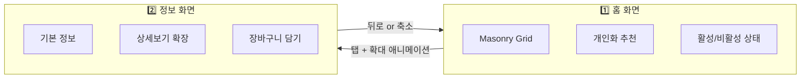

# 🎨 UI/UX 디자인 가이드

> 비건베이커리 앱 - Pinterest 스타일 탐험형 인터페이스

---

## 📌 디자인 컨셉

### 핵심 철학

| 원칙 | 설명 |
|------|------|
| **탐험 중심** | 스크롤만으로 빵을 발견하는 갤러리 경험 |
| **개인화** | 사용자별 선호 빵이 상단에 노출 |
| **최소 조작** | 탭 2번 이내로 구매 완료 |
| **시각적 상태** | 활성/비활성으로 구매 가능 여부 즉시 인지 |

### 차별화 포인트

```
┌─────────────────────────────────────────────────────────────┐
│                                                             │
│  ❌ 일반 베이커리 앱          ✅ 비건베이커리 앱            │
│  ──────────────────          ──────────────────            │
│                                                             │
│  [리스트 뷰]                 [Masonry Grid]                │
│  ┌───────────────┐           ┌─────┬──────────┐            │
│  │ 🥐 소금빵     │           │ 🥐 │  🥖      │            │
│  ├───────────────┤           ├─────┤          │            │
│  │ 🥖 바게트     │           │ 🍞 ├──────────┤            │
│  ├───────────────┤           │     │  🥯      │            │
│  │ 🍞 식빵       │           └─────┴──────────┘            │
│  └───────────────┘           Pinterest 스타일              │
│  단조로운 목록               갤러리 탐험                   │
│                                                             │
└─────────────────────────────────────────────────────────────┘
```

---

## 📱 화면 구조 (2단계)



---

## 1️⃣ 홈 화면 (Masonry Grid + 시간 라벨)

### 화면 구성

> **Option C**: Masonry Grid를 유지하면서 각 카드에 출고 시간 라벨 표시

```
┌─────────────────────────────────┐
│ 🌿 안녕, 종우님                  │
│ 📅 12/16~20 이번 주 라인업       │  ← 주간 라인업 표시
├─────────────────────────────────┤
│                                 │
│ ┌─────────┐ ┌───────────────┐   │
│ │ 🟢 🔁    │ │ 🟢 ✨NEW     │   │
│ │ ⏰ 8:00  │ │ ⏰ 11:00       │   │  ← 각 카드에 시간 라벨
│ │ 소금빵   │ │   시나몬롤     │   │
│ │ 하루2회! │ │   [이미지]    │   │
│ └─────────┘ └───────────────┘   │
│ ┌───────────────┐ ┌─────────┐   │
│ │ ⚫ 💜오랜만   │ │ 🟢      │   │
│ │ ⏰ 8:00     │ │ ⏰ 7:30  │   │
│ │  시금치스콘  │ │ 베이글   │   │  ← 비활성+오랜만 태그
│ │ [흐린 이미지] │ │ [이미지] │   │
│ └───────────────┘ └─────────┘   │
│ ┌───────────────────────────┐   │
│ │ 🟢 🔄RENEWAL               │   │
│ │ ⏰ 11:30                    │   │  ← 리뉴얼 태그
│ │   곰돌이 크림빵  이번주만!   │   │
│ └───────────────────────────┘   │
│                                 │
│ ⬇️ 스크롤하여 더 보기            │
│                                 │
└─────────────────────────────────┘
```

### 주간 라인업 표시

홈 화면 상단에 현재 주차의 라인업 기간을 표시합니다.

| 요소 | 내용 |
|------|------|
| **타이틀** | "📅 12/16~20 이번 주 라인업" |
| **변경 주기** | 매주 월요일 업데이트 |
| **사장님 앱** | 라인업 기간/메뉴 설정 기능 |

---

### 🏷️ 라인업 특수 태그

> 라인업 특성을 반영한 빵 카드 특수 태그 시스템

#### 태그 종류 및 스타일

| 태그 | 의미 | 색상 | 위치 |
|------|------|------|------|
| ✨ **NEW** | 신메뉴 | `#4CAF50` (그린) | 우상단 |
| 🔄 **RENEWAL** | 리뉴얼 메뉴 | `#2196F3` (블루) | 우상단 |
| 💜 **오랜만** | 오랜만에 복귀 | `#9C27B0` (보라) | 우상단 |
| ⚡ **이번주만** | 한정 판매 | `#FF5722` (오렌지) | 하단 라벨 |
| 🔁 **하루2회** | 하루 2번 출고 | `#607D8B` (그레이) | 이름 아래 |
| 📦 **연장!** | 기간 연장 | `#FF9800` (엠버) | 우상단 |

#### 태그 카드 예시

```
┌───────────────┐   ┌───────────────┐   ┌───────────────┐
│     ✨NEW     │   │    �오랜만   │   │   🔄RENEWAL  │
│ ⏰ 7:30      │   │ ⏰ 8:00      │   │ ⏰ 11:00     │
│  [이미지]     │   │  [이미지]     │   │  [이미지]     │
│              │   │              │   │              │
├───────────────┤   ├───────────────┤   ├───────────────┤
│ 고창 꼀고구마   │   │ 시금치 스콘   │   │ 우지 말차     │
│ 🔥 5개       │   │ 🔥 3개       │   │ 🔥 8개       │
└───────────────┘   └───────────────┘   └───────────────┘
    신메뉴             오랜만에 복귀        리뉴얼

┌───────────────┐   ┌───────────────────────────┤
│ 🔁           │   │ ⏰ 12:00                   │
│ ⏰ 8:00,11:30 │   │  [이미지]                   │
│  [이미지]     │   │   곰돌이 크림빵              │
├───────────────┤   │   ━━━━━━━━━━━━━━━━━━━   │
│ 기본소금빵     │   │   ⚡ 이번주까지만 이 시간!   │  ← 한정 태그
│ 하루2회!      │   └───────────────────────────┘
└───────────────┘
   하루 2번 출고
```

#### 태그 우선순위 (중복 시)

```
이번주만 > NEW > RENEWAL > 오랜만 > 하루2회 > 일반
```

특수 태그가 여러 개 해당되면 **우선순위 높은 태그 1개만** 표시

---

### 🎨 하이브리드 카드 레이아웃

> 55종 메뉴로도 풍성한 Masonry 경험을 위한 **다양한 카드 타입** 혼합

#### 카드 타입별 구성

| 타입 | 크기 | 비율 | 용도 |
|------|------|------|------|
| **빵 카드 (기본)** | 1x1 | 60% | 일반 메뉴 |
| **빵 카드 (주목)** | 2x1 | 15% | 인기, 신메뉴, 추천 |
| **리뷰 카드** | 2x1 | 10% | 베스트 리뷰 노출 |
| **스토리 카드** | 2x1 | 10% | 비건 팁, 재료 이야기 |
| **배너/이벤트** | 2x1 | 5% | 공지, 다음주 예고 |

#### 레이아웃 예시

```
┌─────────────────────────────────┐
│ 📅 12/16~20 이번 주 라인업       │
├─────────────────────────────────┤
│                                 │
│ ┌─────────┐ ┌───────────────┐   │
│ │ 🟢 NEW  │ │ 🥇 오늘 1위!  │   │  ← 2x1 주목 카드
│ │ 꿀고구마 │ │   기본소금빵   │   │
│ └─────────┘ │   🔥 인기폭발  │   │
│             └───────────────┘   │
│ ┌─────────┐ ┌─────────┐         │
│ │ 🟢      │ │ 🟢      │         │  ← 1x1 기본 카드
│ │ 베이글   │ │ 스콘    │         │
│ └─────────┘ └─────────┘         │
│ ┌───────────────────────────┐   │
│ │ 💬 "직장인 아침으로 딱!"  │   │  ← 2x1 리뷰 카드
│ │  소금빵 리뷰 - 김*영       │   │
│ └───────────────────────────┘   │
│ ┌─────────┐ ┌─────────┐         │
│ │ ⚫      │ │ 🟢      │         │
│ │ 시나몬롤 │ │ 크림빵   │         │
│ │ ⏰11:00 │ │         │         │
│ └─────────┘ └─────────┘         │
│ ┌───────────────────────────┐   │
│ │ 📖 비건버터의 비밀...     │   │  ← 2x1 스토리 카드
│ │  매일 아침 5시에 만들어요  │   │
│ └───────────────────────────┘   │
│ ┌─────────┐ ┌─────────┐         │
│ │ 🟢      │ │ 🟢      │         │
│ │ 단팥빵   │ │ 토스트   │         │
│ └─────────┘ └─────────┘         │
│ ┌───────────────────────────┐   │
│ │ ✨ 다음 주 신메뉴 예고!   │   │  ← 2x1 배너
│ │  🍓 딸기 시즌 메뉴 출시   │   │
│ └───────────────────────────┘   │
│                                 │
└─────────────────────────────────┘
```

#### 카드 타입별 스펙

##### 빵 카드 - 기본 (1x1)
```
┌─────────────┐
│ [태그]      │  ← 특수 태그 (선택)
│ ⏰ 8:00     │  ← 출고 시간
│ [이미지]    │
│             │
├─────────────┤
│ 메뉴명      │
│ 🔥 N개 남음  │
└─────────────┘
```

##### 빵 카드 - 주목 (2x1)
```
┌───────────────────────────┐
│ 🥇 [태그]                 │  ← 인기/추천
│ ⏰ 8:00                    │
│ [이미지 - 가로 넓게]        │
│                           │
│ 메뉴명      🔥 N개 · ₩3,000│
└───────────────────────────┘
```

##### 리뷰 카드 (2x1)
```
┌───────────────────────────┐
│ 💬 베스트 리뷰             │
│ ────────────────────────  │
│ ⭐⭐⭐⭐⭐                 │
│ "진짜 맛있어요! 추천!"     │
│           - 김*영 (소금빵)  │
└───────────────────────────┘
```

##### 스토리 카드 (2x1)
```
┌───────────────────────────┐
│ 📖 오늘의 비건 이야기       │
│ ────────────────────────  │
│ "비건버터의 비밀"           │
│ 매일 아침 직접 만드는...    │
│              [더보기 →]    │
└───────────────────────────┘
```

##### 배너/이벤트 카드 (2x1)
```
┌───────────────────────────┐
│ ✨ 다음 주 신메뉴 예고      │
│ ────────────────────────  │
│ 🍓 딸기 시즌 메뉴 출시!     │
│ 12/23(월)부터 만나보세요    │
└───────────────────────────┘
```

#### 카드 배치 규칙

1. **2x1 카드**는 연속 2개 이상 배치 금지
2. **리뷰 카드**는 해당 빵 카드 아래에 배치 권장
3. **배너**는 스크롤 3~4회마다 1개 배치
4. **주목 빵 카드**는 인기 TOP 3, 신메뉴에 사용

#### 색상

| 카드 타입 | 배경색 | 테두리 |
|----------|--------|--------|
| 빵 카드 | `#FFFFFF` | 없음 |
| 리뷰 카드 | `#FFF8E1` (연노랑) | 없음 |
| 스토리 카드 | `#E8F5E9` (연그린) | 없음 |
| 배너 | `#E3F2FD` (연블루) | 없음 |

---

### 빵 카드 상태 시스템

#### 활성 상태 (Active) - 구매 가능

```
┌─────────────┐
│             │
│  [빵 이미지] │  ← 선명한 이미지
│   (100%)    │
│             │
├─────────────┤
│ 기본소금빵   │  ← 이름
│ 🔥 8개 남음  │  ← 재고 (선택적)
└─────────────┘
```

**조건**: 현재 시간 ≥ 출고 시간 AND 재고 > 0

**스타일**:
- 이미지 opacity: 100%
- 텍스트: 기본 색상
- 터치 가능

---

#### 비활성 상태 (Inactive) - 아직 안 나옴

```
┌─────────────┐
│             │
│  [빵 이미지] │  ← 흐린 이미지 (grayscale)
│   (50%)     │
│             │
├─────────────┤
│ 크루아상     │
│ ⏰ 11:30 출고│  ← 출고 예정 시간
└─────────────┘
```

**조건**: 현재 시간 < 출고 시간

**스타일**:
- 이미지 opacity: 50% + grayscale
- 출고 시간 뱃지 표시
- 터치 가능 (정보 확인용) → 정보 화면에서 "알림받기" 유도

---

#### 품절 상태 (Sold Out)

```
┌─────────────┐
│             │
│  [빵 이미지] │  ← 흐린 이미지
│   (30%)     │
│    ╳        │  ← 품절 마크
│             │
├─────────────┤
│ ~~바게트~~   │  ← 취소선
│ 품절         │
└─────────────┘
```

**조건**: 재고 = 0

**스타일**:
- 이미지 opacity: 30% + grayscale
- 품절 오버레이 또는 뱃지
- 이름 취소선
- 터치 가능 (알림받기 유도)

---

### 상태별 스타일 정리

| 상태 | 조건 | 이미지 | 텍스트 | 뱃지 |
|------|------|--------|--------|------|
| 🟢 **활성** | 출고됨 & 재고>0 | 100% 컬러 | 기본 | 🔥 N개 남음 |
| ⏰ **예정** | 아직 출고 전 | 50% grayscale | 기본 | ⏰ HH:MM 출고 |
| ⚫ **품절** | 재고=0 | 30% grayscale | ~~취소선~~ | 품절 |

---

### 🏆 인기 빵 시각적 강조

> 일별/주별 인기 빵을 시각적으로 구분하여 사용자의 관심 유도

#### 인기 빵 카드 디자인

```
┌─────────────────────────────────────────────────────────────────┐
│                                                                 │
│  🥇 일간 TOP 1            🥈🥉 일간 TOP 2-3        주간 인기     │
│  ━━━━━━━━━━━             ━━━━━━━━━━━━━            ━━━━━━━━     │
│                                                                 │
│  ╭─────────────╮         ╭─────────────╮       ┌─────────────┐ │
│  │ ✨ shimmer  │         │             │       │ 🔥 WEEKLY   │ │
│  │ [빵 이미지]  │         │ [빵 이미지]  │       │ [빵 이미지]  │ │
│  │             │         │             │       │             │ │
│  │  ═══════    │         │             │       │             │ │
│  │  🥇 기본소금빵│         │ 🥈 시나몬롤  │       │ 베이글      │ │
│  ╰─────────────╯         ╰─────────────╯       └─────────────┘ │
│  ↑                       ↑                     ↑              │
│  골드 테두리              실버 테두리            뱃지만         │
│  + Glow 효과             + 브론즈               (테두리 없음)   │
│  + Shimmer               (약한 효과)                           │
│                                                                 │
└─────────────────────────────────────────────────────────────────┘
```

#### 인기 티어별 스타일

| 티어 | 조건 | 테두리 | 특수효과 | 뱃지 |
|------|------|--------|----------|------|
| 🥇 **1위** | 일간 판매 1위 | 골드 `#FFD700` 3px | Shimmer + Glow | 🥇 |
| 🥈 **2위** | 일간 판매 2위 | 실버 `#C0C0C0` 2px | 약한 Glow | 🥈 |
| 🥉 **3위** | 일간 판매 3위 | 브론즈 `#CD7F32` 2px | 없음 | 🥉 |
| 🔥 **주간** | 이번 주 TOP 5 | 없음 | 없음 | 🔥 WEEKLY |

#### 테두리 색상 코드

| 순위 | 색상 | 코드 | 그림자 |
|------|------|------|--------|
| 🥇 1위 | 골드 | `#FFD700` | `0 0 12px rgba(255,215,0,0.5)` |
| 🥈 2위 | 실버 | `#C0C0C0` | `0 0 8px rgba(192,192,192,0.4)` |
| 🥉 3위 | 브론즈 | `#CD7F32` | 없음 |

#### Shimmer 효과 (1위 전용)

```css
/* 카드 위로 빛이 지나가는 애니메이션 */
@keyframes shimmer {
  0% { background-position: -200% 0; }
  100% { background-position: 200% 0; }
}

.popular-first {
  background: linear-gradient(
    90deg, 
    transparent 0%, 
    rgba(255,255,255,0.4) 50%, 
    transparent 100%
  );
  background-size: 200% 100%;
  animation: shimmer 2s infinite;
}
```

#### 뱃지 위치와 스타일

```
┌─────────────────┐
│ 🥇              │  ← 좌상단 (메달 뱃지)
│                 │
│   [빵 이미지]    │
│                 │
├─────────────────┤
│ 기본소금빵       │
│ 🔥 8개 남음     │
└─────────────────┘

┌─────────────────┐
│        🔥WEEKLY │  ← 우상단 (주간 뱃지)
│   [빵 이미지]    │
│                 │
├─────────────────┤
│ 베이글          │
└─────────────────┘
```

**뱃지 스타일**:
| 뱃지 | 배경색 | 텍스트 | 크기 |
|------|--------|--------|------|
| 🥇🥈🥉 | 투명 | 이모지 | 24px |
| 🔥 WEEKLY | `#FF5722` | 흰색 | 12px, pill 형태 |

#### 우선순위 (중복 시)

```
일간 1위 > 일간 2위 > 일간 3위 > 주간 인기 > 일반
```

일간 순위와 주간 인기가 겹치면 **일간 순위 스타일을 우선** 적용

---

### 개인화 추천 로직

```
┌─────────────────────────────────┐
│   🌿 당신을 위한 추천            │  ← 상단 고정
├─────────────────────────────────┤
│                                 │
│   1. 찜한 빵 (알림 ON)           │  ← 최우선
│   2. 자주 구매한 빵              │
│   3. 유사 취향 고객 인기 빵       │  ← AI 추천
│   4. 오늘 인기 빵                │
│                                 │
└─────────────────────────────────┘
```

**정렬 우선순위**:
1. 사용자가 찜한 빵 (❤️)
2. 구매 이력 기반 선호 빵
3. AI 추천 (유사 고객 패턴)
4. 전체 인기 순

---

## 2️⃣ 정보 화면 (카드 확장형)

### 기본 상태 (접힘)

```
┌─────────────────────────────────┐
│ ← 뒤로                          │
├─────────────────────────────────┤
│ ┌───────────────────────────┐   │
│ │                           │   │
│ │      [빵 이미지 - 크게]    │   │
│ │                           │   │
│ └───────────────────────────┘   │
│                                 │
│ 기본소금빵              ₩3,000  │
│ ⭐ 4.8 (125)    🔥 8개 남음     │
│ 👥 "직장인 아침으로 딱!"        │
│                                 │
│        [📖 상세보기 ∨]          │  ← 탭하면 확장
│                                 │
├─────────────────────────────────┤
│   [🛒 장바구니 담기]    ← 하단 고정 │
└─────────────────────────────────┘
```

### 확장 상태 (펼침)

```
┌─────────────────────────────────┐
│ ← 뒤로                          │
├─────────────────────────────────┤
│ ┌───────────────────────────┐   │
│ │      [빵 이미지 - 크게]    │   │
│ └───────────────────────────┘   │
│                                 │
│ 기본소금빵              ₩3,000  │
│ ⭐ 4.8 (125)    🔥 8개 남음     │
│ 👥 "직장인 아침으로 딱!"        │
│                                 │
│        [📖 접기 ∧]              │
│ ─────────────────────────────── │
│ 📖 스토리                       │
│ "매일 아침 5시, 비건버터를      │
│  직접 만들어 반죽에 섞습니다..." │
│                                 │
│ ─────────────────────────────── │
│ 📋 영양정보                     │
│ • 칼로리: 280kcal               │
│ • 원재료: 밀가루, 비건버터...   │
│ • 알레르기: 밀                  │
│                                 │
│ ─────────────────────────────── │
│ ⭐ 베스트 리뷰                  │
│ ┌───────────────────────────┐   │
│ │ ⭐⭐⭐⭐⭐ 김*영            │   │
│ │ "진짜 맛있어요!"           │   │
│ │ 👍 23명이 도움됐어요       │   │
│ └───────────────────────────┘   │
│        [전체 리뷰 125개 →]      │
│                                 │
├─────────────────────────────────┤
│   [🛒 장바구니 담기]    ← 하단 고정 │
└─────────────────────────────────┘
```

### 비활성 빵의 정보 화면

```
┌─────────────────────────────────┐
│ ← 뒤로                          │
├─────────────────────────────────┤
│ ┌───────────────────────────┐   │
│ │      [흐린 빵 이미지]       │   │
│ └───────────────────────────┘   │
│                                 │
│ 크루아상                ₩3,500  │
│ ⏰ 11:30 출고 예정              │  ← 비활성 안내
│                                 │
│ ┌───────────────────────────┐   │
│ │  🔔 출고되면 알림받기      │   │  ← CTA 변경
│ └───────────────────────────┘   │
│                                 │
│        [📖 상세보기 ∨]          │
│                                 │
├─────────────────────────────────┤
│   [🛒 담기] ← 비활성 (회색)     │  ← 버튼 비활성화
└─────────────────────────────────┘
```

---

## 🎬 전환 애니메이션

### 홈 → 정보 (확대 애니메이션)

```
1. 탭한 카드가 확대되며 전체 화면으로 채움
2. 배경 카드들은 blur 처리 후 fade out
3. 확대 완료 후 정보 화면 요소들 fade in

Duration: 300ms
Easing: ease-out
```

### 정보 → 홈 (축소 애니메이션)

```
1. 정보 화면 요소들 fade out
2. 이미지가 축소되며 원래 카드 위치로 이동
3. 배경 카드들 fade in

Duration: 250ms
Easing: ease-in
```

---

## 🎨 컴포넌트 스펙

### 빵 카드 (Masonry Card)

| 속성 | 값 |
|------|-----|
| 너비 | 화면의 (100% - 48px) / 2 |
| 높이 | 이미지 비율에 따라 가변 |
| 모서리 | 16px border-radius |
| 그림자 | `0 2px 8px rgba(0,0,0,0.1)` |
| 간격 | 12px (좌우, 상하) |

### 상세보기 버튼

| 상태 | 스타일 |
|------|--------|
| 기본 | 테두리만, 투명 배경 |
| 탭 시 | 배경 살짝 어둡게 |
| 확장 후 | 아이콘 ∨ → ∧ 변경 |

### 장바구니 담기 버튼

| 상태 | 스타일 |
|------|--------|
| 활성 | Primary 컬러 (#43A047), 흰색 텍스트 |
| 비활성 | 회색 (#BDBDBD), 터치 불가 |
| 탭 시 | 살짝 어둡게, ripple 효과 |

---

## 🔤 타이포그래피

| 용도 | 폰트 | 크기 | 굵기 |
|------|------|------|------|
| 인사말 | Pretendard | 24px | Bold |
| 빵 이름 (카드) | Pretendard | 14px | Medium |
| 빵 이름 (정보) | Pretendard | 22px | Bold |
| 가격 | Pretendard | 20px | Bold |
| 설명/본문 | Pretendard | 15px | Regular |
| 태그/뱃지 | Pretendard | 12px | Medium |

---

## 🎨 컬러 팔레트

| 용도 | 색상 | 코드 |
|------|------|------|
| Primary (그린) | 🟢 | `#43A047` |
| Secondary (브라운) | 🟤 | `#8D6E63` |
| Active 뱃지 | 🔥 | `#FF7043` |
| 예정 뱃지 | ⏰ | `#FFA726` |
| 품절 | ⚫ | `#9E9E9E` |
| 배경 | ⬜ | `#FAFAFA` |
| 카드 배경 | ⬜ | `#FFFFFF` |
| 텍스트 기본 | ⬛ | `#212121` |
| 텍스트 보조 | ⚫ | `#757575` |
| 비활성 | 회색 | `#BDBDBD` |

---

## 📐 레이아웃 수치

| 항목 | 값 |
|------|-----|
| 화면 너비 | 390px (iPhone 14 기준) |
| 좌우 패딩 | 20px |
| Masonry 갭 | 12px |
| 카드 border-radius | 16px |
| 버튼 border-radius | 12px |
| 하단 고정 버튼 높이 | 56px |
| 하단 Safe Area | 34px |

---

## 🔧 피그마 작업 가이드

### 작업 순서

1. **스타일 정의**
   - Color Styles 등록
   - Text Styles 등록

2. **컴포넌트 제작**
   - 빵 카드 (3가지 상태: 활성/예정/품절)
   - 상세보기 버튼
   - 장바구니 버튼
   - 상태 뱃지

3. **화면 제작**
   - 홈 화면 (Masonry Grid)
   - 정보 화면 (기본/확장)

4. **프로토타입**
   - 홈 → 정보 전환 (Smart Animate)
   - 상세보기 확장 (Expand)

---

## ✅ 체크리스트

- [ ] Color Styles 등록
- [ ] Text Styles 등록
- [ ] 빵 카드 컴포넌트 (3가지 상태)
- [ ] 정보 화면 컴포넌트
- [ ] 홈 화면 레이아웃
- [ ] 정보 화면 레이아웃
- [ ] 프로토타입 연결
